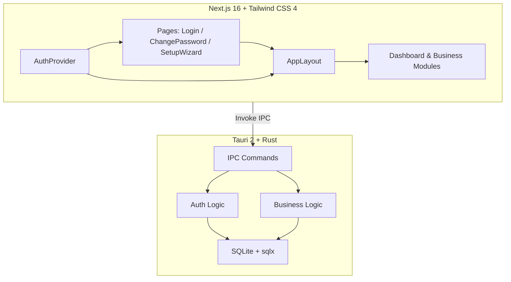
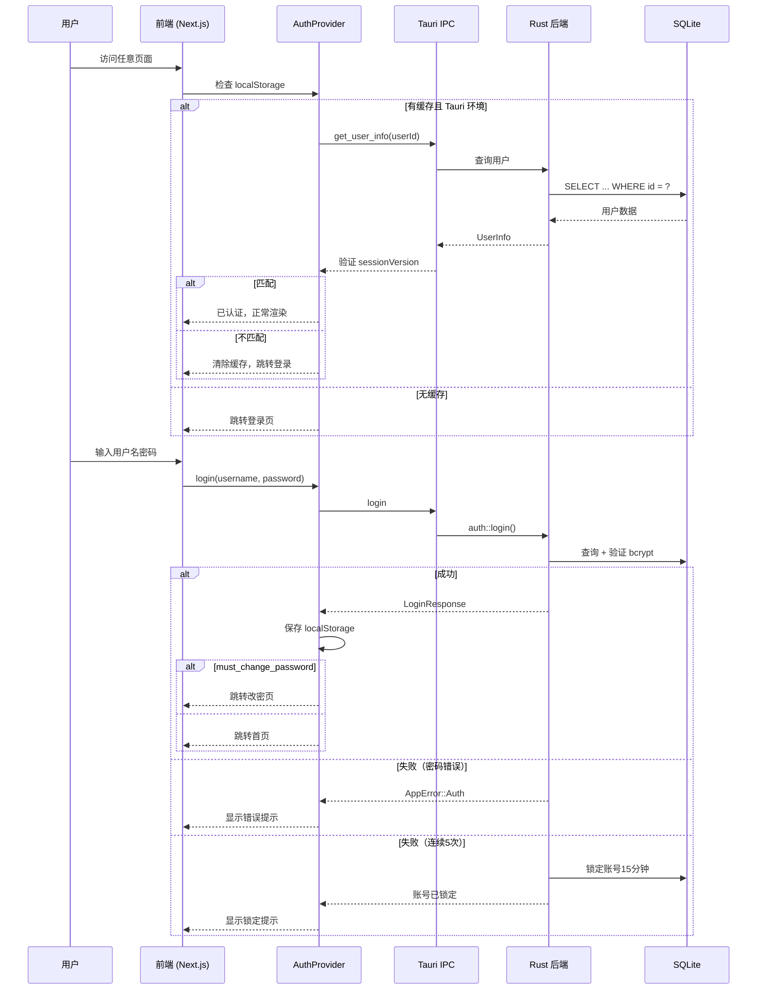

# 云枢 (CloudPivot IMS)

> **项目代号**：云枢 (CloudPivot IMS)

> **工厂所在地**：🇻🇳 越南

> **文档版本**：v1.7

> **更新日期**：2026-04-15

## 文档索引

| #   | 文档                                      | 核心内容                                                                  |
| --- | ----------------------------------------- | ------------------------------------------------------------------------- |
| 1   | [需求规格说明书](docs/01-requirements.md) | 项目背景、系统架构、**12 大功能模块**详细设计（含权限矩阵、财务闭环规则） |
| 2   | [数据库设计](docs/02-database-design.md)  | ER 关系图、**45 张表** DDL、迁移策略                                      |
| 3   | [界面原型设计](docs/03-ui-prototype.md)   | 整体布局、**30 个页面** wireframe、交互规范、全量页面地图                 |
| 4   | [开发计划](docs/04-development-plan.md)   | 甘特图、**5 个开发阶段**任务清单、技术风险                                |

## 快速概览

**一句话描述**：面向越南家具生产工厂的桌面端进销存管理系统，支持多语言（中/越/英）、多币种（VND/CNY/USD）、轻量批次追溯、定制单管理、智能补货等核心业务。

**技术栈**：Tauri 2 + Next.js 16 + TypeScript + shadcn/ui + Tailwind CSS 4 + SQLite

**目标平台**：Windows 10/11、macOS

**预估工期**：32–36 周（5 个迭代阶段，含联调与回归缓冲）

**范围边界**：`v1.0` 提供业务单据、库存、报表、打印与基础财务辅助能力，不替代专业财务软件，也不等同于越南法定税务/发票系统。

## 功能模块一览

```
📊 首页看板 — KPI 指标、趋势图、待办事项、补货提醒
📦 基础数据 — 物料管理、分类管理、供应商、客户、仓库、单位管理
📋 BOM — 物料清单、成本核算、需求展算
🛒 采购管理 — 采购单（含运费/关税）、采购入库、采购退货
💰 销售管理 — 销售单、销售出库、销售退货
🏭 库存管理 — 库存查询、出入库流水、盘点、调拨、预警、批次追溯
🎨 定制单管理 — 非标定制单、定制配置、成本核算、生产跟踪
📦 智能补货 — 补货建议、消耗趋势、一键生成采购单
💳 财务管理 — 应付账款、应收账款、收付款登记（多币种）
📈 报表中心 — 采购报表、销售报表、库存报表、标准/实际毛利分析
⚙️ 系统设置 — 企业信息、编码规则、库存规则、数据备份、汇率管理
🌐 国际化 — 中/越/英三语切换、VND/CNY/USD 多币种
🖨️ 打印模板 — 9 种固定单据模板、多语言/双语打印、PDF 导出
```

## 技术架构



## 认证流程

系统采用 bcrypt 密码哈希 + session_version 会话校验机制，支持连续失败锁定和首次登录强制改密。



### 安全设计要点

| 机制             | 说明                                                |
| ---------------- | --------------------------------------------------- |
| **密码存储**     | bcrypt 哈希（cost = 12），数据库不存储明文          |
| **连续失败锁定** | 连续 5 次错误 → 账号锁定 15 分钟                    |
| **首次改密**     | `must_change_password` 标记，强制跳转改密页         |
| **会话版本**     | `session_version` 字段，改密后递增，旧会话自动失效  |
| **默认密码防御** | 改密时禁止使用初始密码 `admin123`                   |
| **环境降级**     | 非 Tauri 开发环境自动使用 mock 数据，不影响 UI 开发 |

## 项目结构

```
app/                        # Next.js App Router（Tauri 生产构建使用 SSG）
  layout.tsx                # 根布局：字体（Inter + Noto Sans SC + Raleway）
  globals.css               # 主题系统（浅色/深色 CSS 变量，遵循 shadcn 规范）
  page.tsx                  # 根路由重定向
  [locale]/                 # i18n 路由（next-intl）
    layout.tsx              # NextIntlClientProvider + ThemeProvider + AuthProvider + AppLayout
    page.tsx                # 首页看板
    login/page.tsx          # 登录页
    change-password/page.tsx # 首次改密页
    _components/            # 看板子组件目录
      dashboard-content.tsx # 看板主内容编排
      dashboard/            # 看板拆分组件（7 个）
    {模块名}/page.tsx       # 业务页面（23 个路由目录）
components/
  ui/                       # shadcn/ui 组件（base-nova 风格，基于 @base-ui/react）
  layout/                   # 布局组件：AppLayout、Sidebar、Header、LocaleSwitcher、AppFooter
  providers/                # ThemeProvider（next-themes）+ AuthProvider（认证 + 路由守卫）
  common/                   # 通用组件：PagePlaceholder
config/nav.ts               # 侧边栏导航树 — 路由的唯一真实来源
i18n/                       # next-intl 配置（config / routing / request / navigation）
messages/                   # 三语翻译文件（按模块拆分）
  zh/                       # 中文（auth / common / dashboard / materials / settings / setup-wizard）
  en/                       # 英文
  vi/                       # 越南语
lib/
  utils.ts                  # cn() 工具函数（clsx + tailwind-merge）
  tauri.ts                  # Tauri IPC 通信封装（invoke 泛型 + 认证命令 + 非 Tauri 降级）
  currency.ts               # 多币种格式化工具（VND/CNY/USD，整数存储 ↔ 显示金额转换）
  types/
    system-config.ts        # 系统配置键名枚举 + TypeScript 类型
src-tauri/                  # Rust 后端
  Cargo.toml                # tauri 2.10, sqlx(sqlite), bcrypt, chrono, uuid, thiserror
  src/
    lib.rs                  # Tauri Builder：日志 + 数据库初始化 + 管理员初始化 + IPC 注册
    main.rs                 # 入口
    error.rs                # 统一错误类型（AppError: Database/Sqlx/Auth/Business/Io）
    auth.rs                 # 认证模块：登录（含锁定）、改密（含强度校验）、管理员初始化
    db/
      mod.rs                # SQLite 连接池初始化 + PRAGMA 配置（WAL 模式）
      migration.rs          # 自管理迁移框架（include_str! 内嵌 SQL，版本化执行）
    commands/
      mod.rs                # IPC 命令：ping、get_db_version、login、change_password、get_user_info
  migrations/sqlite/
    001_init.sql            # 建表迁移（45 张表 DDL，44KB）
    002_seed_data.sql       # 种子数据（系统配置、默认分类等）
.github/workflows/
  ci.yml                    # CI 流水线：lint + test + 四平台构建验证
  release.yml               # 发布流水线：tag 触发 → 四平台出包 → GitHub Release
docs/                       # 设计文档（共约 6000 行）
justfile                    # 任务运行器（just）
```

## 开发命令

本项目使用 `just`（[Justfile](https://just.systems/)）作为任务运行器，统合了 pnpm 和 cargo 的常用操作。你可以通过 `just --list` 查看所有可用命令。

```bash
# === 开发 ===
just dev                    # 启动 Tauri 开发模式（前端 + 后端热重载）
just dev-web                # 仅启动 Next.js 前端开发服务器

# === 构建 ===
just build                  # 构建生产版本（Tauri 桌面应用）
just build-web              # 仅构建 Next.js 前端
just build-debug            # 构建 Debug 版本（含调试符号）

# === 代码质量 ===
just lint                   # 运行全部代码检查（前端 + 后端）
just fmt                    # 格式化全部代码（prettier + cargo fmt）
just test                   # 运行全部测试

# === 版本与发布 ===
just version <ver>          # 同步更新所有配置文件的版本号
just release <tag>          # 一键发布：版本号 → CHANGELOG → commit → tag → push

# === 工具 ===
just ui <组件名>             # 安装 shadcn/ui 组件
just i18n-check             # 检查翻译文件完整性
just icon                   # 基于 app-icon.png 生成全平台图标
just install                # 安装全部依赖（pnpm + cargo fetch）
just clean                  # 清理构建产物
```

## 当前进度

**阶段一**（基础框架）：✅ 已完成

- [x] 项目脚手架 — Tauri 2 + Next.js 16 + shadcn/ui
- [x] 国际化框架 — next-intl 三语切换（看板及基础系统组件已全面本地化）
- [x] 布局组件 — 侧边栏 + 顶栏 + 语言/主题切换
- [x] 首页看板 — KPI 卡片 + 图表 + 7 个模块化子组件
- [x] 深浅主题 — CSS 变量 + next-themes + 显示偏好联动
- [x] 工程体验优化 — 完善 Justfile 及接入 Apple HIG 规范的系统图标生成
- [x] 系统设置模块 — 「企业信息」及「显示偏好」页面 UI 及双向数据联调
- [x] 首次使用向导 — 拦截新用户强制配置核心参数与基础仓库
- [x] 品牌闪屏 — Splash Screen 加载动画组件
- [x] Rust 数据库层 — SQLite 连接池 + 迁移引擎 + 45 张表
- [x] IPC 通信层 — ping / db_version / 认证命令
- [x] 用户认证 — bcrypt + 锁定 + 改密 + AuthProvider + 路由守卫
- [x] 前端工具库 — 多币种格式化 + 系统配置类型
- [x] 多语言重构 — i18n 翻译文件按模块拆分（6 个域）

**阶段二**（核心业务）：🏃‍♂️ 进行中

- [x] 物料管理 — 前端完整功能与逻辑联调
- [ ] 剩余 20+ 业务模块页面 UI 骨架搭建与对接
- [ ] Repository 抽象层与业务数据 CRUD
- [ ] 核心业务 IPC 命令实现与联调（供应商、客户、仓库等）

**阶段五**（工程化）：🏃‍♂️ 部分完成

- [x] CI/CD 流水线 — GitHub Actions 四平台自动化检查与构建
- [x] 安装包构建与分发 — tag 触发出包 + Updater 签名 + `just release` 一键发布

## 路线图

### 阶段二：核心业务模块

- [ ] Repository trait 抽象（业务数据 CRUD）
- [x] 物料管理模块（分类、物料 CRUD、库存查询）
- [ ] 供应商管理模块
- [ ] 客户管理模块
- [ ] 仓库管理模块

### 阶段三：单据与流程

- [ ] 采购单据（采购订单、入库单）
- [ ] 销售单据（销售订单、出库单）
- [ ] 生产工单
- [ ] 库存盘点

### 阶段四：报表与系统

- [ ] 统计报表（销售报表、采购报表、库存报表）
- [ ] 系统设置（用户管理、系统配置、操作日志）
- [ ] 数据备份与恢复

### 阶段五：优化与发布

- [ ] 性能优化
- [x] CI/CD 流水线
- [x] 安装包构建与分发
