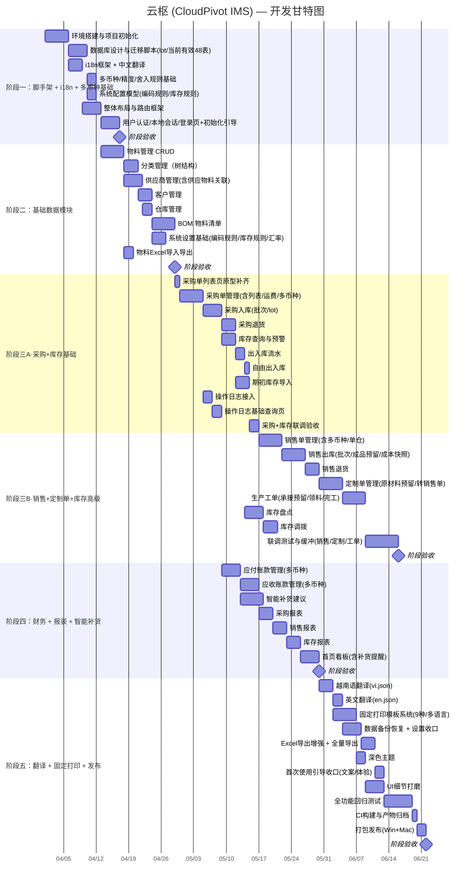

# 云枢 (CloudPivot IMS) — 开发计划

> **版本**：v2.8 &nbsp;|&nbsp; **日期**：2026-07-15
> **工厂所在地**：越南
> **更新**：2026-07-15，同步菜单开放状态（12 大模块全部开放，仅库存调拨隐藏）；订正用户管理已提前实现多账号+三角色权限（0.2.1）

---

#### 团队配置

| 角色     | 人数 | 职责                                        |
| -------- | ---- | ------------------------------------------- |
| 全栈开发 | 1 人 | Rust 后端 + Next.js 前端 + 数据库 + UI 实现 |
| AI 辅助  | —    | 代码生成、文档编写、代码审查、翻译初稿      |

> **说明**：以单人全栈开发 + AI 辅助为基准估算工期。越南语翻译初稿由 AI 生成，由越南本地同事校审。测试以开发自测 + 用户验收（UAT）为主，不设专职 QA。

---

## 1. 开发阶段概览

项目采用**分阶段迭代**开发模式，共分为 **5 个阶段**，预计总工期 **32–36 周**（含联调、弹性回归与代码签名等缓冲时间）。

> **核心策略**：i18n 国际化框架和多币种基础**从阶段一就搭建**，避免后期返工。



> **⚠️ 并行假设说明**：本甘特图基于理论最短路径绘制，部分任务标注的并行关系表示"无强依赖，可灵活调整顺序"，而非要求同时执行。单人开发场景下，实际执行为串行推进，各阶段的时间窗口已包含足够缓冲。

---

## 2. 各阶段详细任务

### 阶段一：脚手架 + i18n + 多币种基础（约 4 周）

> **目标**：搭建可运行的项目骨架，**从第一行代码就使用 i18n 和多币种基础设施**，避免后续返工。

> **📊 进度**（截至 2026-05-29）：阶段一目标已全部达成。当前代码已完成认证、本地会话持久化、首次使用向导、系统设置基础能力、首页看板真实数据接入与 CI/CD 流水线；汇率配置通过系统设置页与 `system_config` 持久化，侧边栏按阶段性策略开放部分菜单。

#### 任务清单

| #     | 任务                                                                                                                                                                                                 | 预估 | 产出物                                   | 状态                                                                                 |
| ----- | ---------------------------------------------------------------------------------------------------------------------------------------------------------------------------------------------------- | ---- | ---------------------------------------- | ------------------------------------------------------------------------------------ |
| 1.0   | **技术验证（扩展）** — ① Next.js 16 SSG + `[locale]` 路由 + Tauri 文件协议端到端验证 ② WebView `window.print()` 打印权限验证 ③ Tauri 本地会话文件持久化验证 ④ Updater/原生菜单桥接验证 | 1d   | 验证报告 + POC 代码                      | ✅ 已完成（Next export 条件、Tauri 环境识别、打印权限、会话文件和更新检查均已落地） |
| 1.1   | 使用 `create-tauri-app` 初始化项目                                                                                                                                                                   | 0.5d | 项目骨架                                 | ✅ 已完成                                                                            |
| 1.2   | 配置 Next.js 16 + TypeScript + Tailwind CSS 4                                                                                                                                                        | 0.5d | 构建配置                                 | ✅ 已完成                                                                            |
| 1.3   | 安装 shadcn/ui + lucide-react                                                                                                                                                                        | 0.5d | UI 组件基础                              | ✅ 已完成                                                                            |
| 1.4   | 配置 Biome + TypeScript + cargo fmt/clippy（代码规范）                                                                                                                                                | 0.5d | biome.json / tsconfig / rustfmt          | ✅ 已完成                                                                            |
| 1.5   | Rust 端集成 sqlx + PostgreSQL 驱动                                                                                                                                                                   | 1.5d | Cargo.toml / db 模块                     | ✅ 已完成（sqlx+PostgreSQL 连接池，从 SQLite 迁移完成）                              |
| 1.6   | 编写数据库迁移脚本（全部 DDL + `inventory_lots` + `inventory_reservation_lots` + `default_warehouses` + `session_version` 等新结构）                                                                 | 2d   | migrations/\*.sql                        | ✅ 已完成（001_init.sql 1078 行 45 张基础表；003/004/005 后当前有效业务表 48 张；002_seed_data.sql 90 行） |
| 1.7   | 实现数据库初始化与迁移逻辑                                                                                                                                                                           | 1d   | db/migration.rs                          | ✅ 已完成（db/mod.rs + db/migration.rs，`schema_migrations` + `after_connect` 时区初始化） |
| 1.8   | **i18n 框架搭建** — next-intl + `[locale]` 路由                                                                                                                                                      | 1.5d | i18n 配置 + zh.json 骨架                 | ✅ 已完成                                                                            |
| 1.9   | **三语翻译文件** — 全量 UI 文案（与开发同步迭代）                                                                                                                                                    | 1d   | messages/{zh,vi,en}/                     | ✅ 已完成（20 域/语言，当前每语言 2138 个叶子 key，`just i18n-check` 校验一致）      |
| 1.10  | **多币种/精度基础** — 汇率 CRUD + currency/quantity 格式化工具 + USD 折算/舍入规则封装                                                                                                               | 1.5d | lib/currency.ts                          | ✅ 已完成（`currency.ts` + 汇率设置页 + `system_config` 持久化）                     |
| 1.11  | **系统配置模型** — 初始化编码规则/库存规则/打印参数/订单仓库模式配置项                                                                                                                               | 1d   | `system_config` 种子数据                 | ✅ 已完成（50+ 配置项种子数据 + system-config.ts 类型定义 + get/set IPC 命令）        |
| 1.12  | 前端整体布局组件（侧边栏+顶栏+语言切换器）                                                                                                                                                           | 2d   | Layout 组件                              | ✅ 已完成                                                                            |
| 1.13  | 前端 App Router 路由配置                                                                                                                                                                             | 1d   | app/[locale]/                            | ✅ 已完成                                                                            |
| 1.14  | 封装 Tauri IPC 调用                                                                                                                                                                                  | 0.5d | lib/tauri.ts / lib/tauri/                | ✅ 已完成（泛型 invoke + 全部分域命令 + Tauri 2 环境识别 + 非 Tauri 降级）             |
| 1.15  | 验证前后端 IPC 通信（ping-pong 测试）                                                                                                                                                                | 0.5d | —                                        | ✅ 已完成（认证、系统设置、业务单据、库存、财务、报表等 IPC 均已注册）              |
| 1.16  | **用户认证** — Rust 端 bcrypt + `session_version` + 登录/登出 Command                                                                                                                                | 1.5d | users 表 + auth 模块                     | ✅ 已完成（auth.rs 237 行，含 5 次失败锁定 15 分钟）                                 |
| 1.17  | **登录页面** — 登录表单 + 记住我（认证会话文件）+ 首次强制改密                                                                                                                                       | 1.5d | 登录页组件                               | ✅ 已完成（login/page.tsx + change-password/page.tsx）                               |
| 1.18  | **认证守卫** — 路由守卫 + 本地会话失效处理（v1.0 不做权限判断，全部放行）                                                                                                                            | 0.5d | AuthProvider                             | ✅ 已完成（auth-provider.tsx 含认证会话文件持久化 + session_version 验证）           |
| 1.18a | **初始化状态检测 + 首次使用向导** — 登录并完成首次改密后触发企业信息/基础仓库/导入引导                                                                                                               | 1.5d | 向导页组件                               | ✅ 已完成（setup-wizard 多步骤向导 + setup_create_warehouses IPC 命令）               |
| 1.19  | **CI 基础搭建** — GitHub Actions: `cargo check` + `cargo clippy` + `cargo test` + `pnpm build` + `tsc --noEmit`                                                                                      | 0.5d | CI 配置                                  | ✅ 已完成（GitHub Actions CI + release workflow）                                   |

> **集成测试**：阶段末预留 1 天进行前后端联调测试，验证 IPC 通信、数据库操作、UI 交互和本地会话完整性。

#### 验收标准

- [x] 项目可通过 `pnpm tauri dev` 正常启动
- [x] PostgreSQL 数据库连接成功并完成迁移（当前有效业务表 48 张 + 种子数据）
- [x] 前端页面布局正常渲染，侧边栏可折叠
- [x] **i18n 框架工作正常**，顶栏可切换语言（UI 文案通过 `t()` 函数获取）
- [x] **多币种格式化正常**（₫29,250,000 / ¥280.00 / $1,200.00）
- [x] 原币金额、USD 折算金额和舍入规则在前后端保持一致
- [x] `system_config` 已包含编码规则、库存规则、打印参数和订单仓库模式等基础配置项（50+ 项）
- [x] `v1.0` 基准币种固定 USD，首次使用向导不开放切换
- [x] 应用首次启动默认进入登录页，内置管理员可使用 `admin/admin123` 登录
- [x] 前端可通过 IPC 调用 Rust 端并获得数据库数据（ping + get_db_version + 认证命令 + 系统配置 + 物料/分类/供应商 CRUD）
- [x] 用户可通过账号密码登录系统（初始 admin/admin123）
- [x] 首次登录强制修改密码（change-password 页面已实现）
- [x] 如系统尚未完成初始化配置，登录并完成首次改密后自动进入首次使用向导
- [x] "记住我"仅保存本地会话凭证，不保存明文密码；Tauri 环境写入~/.cloudpivot/data/auth_session.json，改密后通过 `session_version` 失效
- [x] v1.0 单帐号模式下，内置管理员拥有全部页面和操作权限，无需权限判断

---

### 阶段二：基础数据模块（约 3.5 周）

> **目标**：完成所有基础数据的 CRUD 功能，所有 UI 文案使用 `t()` 函数。

> **📊 进度**（截至 2026-05-29）：基础数据模块已完成并稳定运行。物料、分类、供应商、客户、仓库、单位、BOM、系统设置基础页和物料 Excel 导入导出均已落地；用户管理当时仍为占位页（0.2.1 起已升级为完整多账号 + 三角色管理界面，详见第 7 节）。

#### 任务清单

| #     | 任务                                                                  | 预估 | 优先级 | 依赖    | 状态                                                                        |
| ----- | --------------------------------------------------------------------- | ---- | ------ | ------- | --------------------------------------------------------------------------- |
| 2.1   | **物料管理** — Rust CRUD Commands（含单位引用/批次追踪模式）          | 2d   | P0     | 1.\*    | ✅ 已完成（7 个 IPC 命令：get_categories/get_units/get_materials/get_material_by_id/generate_material_code/save_material/toggle_material_status） |
| 2.2   | **物料管理** — 列表页（搜索、筛选、分页）                             | 1.5d | P0     | 2.1     | ✅ 已完成（关键词/分类/类型/状态筛选 + 分页）                                |
| 2.3   | **物料管理** — 新增/编辑弹窗表单                                      | 1.5d | P0     | 2.1     | ✅ 已完成（MaterialFormDialog 弹窗表单）                                     |
| 2.4   | **分类管理** — Rust 树结构 CRUD                                       | 1.5d | P0     | 1.\*    | ✅ 已完成（5 个 IPC 命令：get_category_tree/create/update/delete/排序）       |
| 2.5   | **分类管理** — 树形列表页 + 编辑弹窗                                  | 1.5d | P0     | 2.4     | ✅ 已完成（react-arborist 树形 + 拖拽排序 + 编辑弹窗）                       |
| 2.6   | **供应商管理** — Rust CRUD（含供应物料关联）                          | 1.5d | P0     | 1.\*    | ✅ 已完成（11 个 IPC 命令：CRUD + 详情 + 物料关联 + 编码生成）               |
| 2.7   | **供应商管理** — 列表页 + 编辑弹窗 + 物料关联 Tab                     | 2d   | P0     | 2.6     | ✅ 已完成（列表筛选分页 + 编辑弹窗 + 详情弹窗 + 物料关联 + 删除）            |
| 2.8   | **客户管理** — Rust CRUD                                              | 1d   | P0     | 1.\*    | ✅ 已完成（7 个 IPC 命令：get_customers/get_customer_by_id/get_customer_detail/save_customer/delete_customer/toggle_customer_status/generate_customer_code） |
| 2.9   | **客户管理** — 列表页 + 编辑弹窗                                      | 1.5d | P0     | 2.8     | ✅ 已完成（列表筛选分页 + 编辑弹窗 + 详情弹窗 + 删除保护 + 编码自动生成）            |
| 2.10  | **仓库管理** — Rust CRUD + 前端页面（含默认仓映射）                   | 2d   | P0     | 1.\*    | ✅ 已完成（8 个 IPC 命令 + 轻量 Card+Table 列表 + 编辑弹窗 + 默认仓映射）  |
| 2.10a | **单位管理** — Rust CRUD + 前端列表/编辑页面（预置单位 + 自定义单位） | 1d   | P0     | 1.\*    | ✅ 已完成（5 个 IPC 命令 + 轻量 Card+Table 列表 + 编辑弹窗）               |
| 2.11  | **BOM 管理** — Rust 层（含成本核算、需求展算、**物料反查功能**）      | 2d   | P1     | 2.1     | ✅ 已完成（10 个 IPC 命令：列表/详情/保存/删除/状态切换/复制/反查/需求计算/父项物料/子物料搜索） |
| 2.12  | **BOM 管理** — 编辑页面（明细表格 + 需求计算区）                      | 2.5d | P1     | 2.11    | ✅ 已完成（列表页 + 编辑页 + 明细弹窗 + 物料反查 + 复制弹窗 + 三语翻译）   |
| 2.13  | 通用组件抽取（物料选择器、分类级联、单位选择器等）                    | 1d   | P1     | 2.2~2.5 | 🔶 部分完成（BusinessListTableShell、PaginationControls、Combobox、ConfirmDialog 已抽取；复杂物料选择仍由页面/模块组合实现） |
| 2.14  | **系统设置基础** — 编码规则/库存规则/汇率管理页面                     | 2d   | P1     | 1.11    | ✅ 已完成（9 个页面路由：企业信息/外观/编码规则/库存规则/打印/汇率/数据管理/日志/用户管理） |
| 2.15  | ~~**用户管理占位页**~~ — 保留设置页路由与提示态，正式多帐号功能移至 v2.0 | 0.5d | P2     | 1.16    | ✅ 已完成占位页；multi-account 已于 0.2.1（2026-06-02）提前实现，`/settings/user-management` 现为完整用户 CRUD + 角色分配页面，仅管理员可见 |
| 2.16  | **物料 Excel 导入导出** — 模板、字段映射、预览校验                    | 1.5d | P1     | 2.1     | ✅ 已完成（模板下载 + 预览校验 + 多语言列头 + 导入/导出 IPC + 核心字段引用保护）          |

> **集成测试**：阶段末预留 1 天进行前后端联调测试，验证基础资料、单位精度和默认仓映射完整性。

#### 验收标准

- [x] 物料、分类、供应商、客户、仓库、单位均可正常增删改查
- [x] **供应商支持关联供应物料**（报价、交货周期、首选标记）
- [x] 分类树支持多级展示和拖拽排序
- [x] 物料可关联分类，成品可创建 BOM
- [x] 物料可配置批次追踪模式，单位精度规则生效
- [x] BOM 需求展算正确（含损耗率计算）
- [x] 默认仓映射可按原材料/半成品/成品正确带出
- [x] 单位管理支持预置单位浏览和自定义单位的增删改查
- [x] 编码规则、库存规则、汇率管理页面可完成基础维护
- [ ] 所有页面 UI 文案通过 i18n 获取，无硬编码
- [x] 物料可通过 Excel 模板导入导出，字段映射、校验提示和多语言列头可用

---

### 阶段三A：采购 + 库存基础（约 4 周）

> **目标**：完成采购全流程和库存基础能力，实现采购→入库→库存变动→出入库流水全链路。
> **缓冲说明**：本子阶段含 0.5 周联调缓冲，用于采购与库存模块之间的端到端联调和需求微调。

> **📊 进度**（截至 2026-05-29）：阶段三A已完成。采购单、采购入库、采购退货、库存查询、出入库流水、期初库存导入与操作日志均已交付；自由出入库已进一步升级为批量草稿单据（迁移 `005_manual_stock_movements.sql` + 5 个 IPC + 列表/编辑页）。

#### 任务清单

| #            | 任务                                                                         | 预估 | 优先级 | 依赖 |
| ------------ | ---------------------------------------------------------------------------- | ---- | ------ | ---- |
| **采购**     |                                                                              |      |        |      |
| 3.1          | 采购单 — Rust 层（创建/审核/作废/状态流转/**含运费+多币种+订单级单仓规则**） | 2.5d | P0     | 2.\* |
| 3.2          | 采购单 — 列表页 + 筛选                                                       | 1.5d | P0     | 3.1  |
| 3.3          | 采购单 — 详情/编辑页（明细表格、inline 编辑、**币种切换、只读仓库快照**）    | 2d   | P0     | 3.1  |
| 3.4          | 采购入库 — Rust 层（关联采购单、分批入库、**批次生成**、自动更新库存）       | 2.5d | P0     | 3.1  |
| 3.5          | 采购入库 — 前端页面                                                          | 1.5d | P0     | 3.4  |
| 3.6          | 采购退货 — Rust 层 + 前端页面（**必须关联原入库单/原批次**）                 | 2d   | P1     | 3.4  |
| **库存基础** |                                                                              |      |        |      |
| 3.13         | 库存查询 — Rust 聚合查询（**物理库存/预留库存/可用库存/批次库存**）          | 2d   | P0     | 3.4  |
| 3.14         | 库存查询 — 前端页面（折叠详情、预警高亮、**可用库存口径**）                  | 1.5d | P0     | 3.13 |
| 3.15         | 出入库流水 — 查询 + 前端列表（含来源行/批次追溯）                            | 1.5d | P0     | 3.4  |
| 3.16         | 期初库存导入 — Rust 层 + 导入向导（模板校验、其他入库流水、lot 初始化）      | 2d   | P0     | 3.13 |
| 3.17         | 操作日志采集 — 登录/审核/作废/确认/导入等关键动作落库                        | 1d   | P0     | 1.\* | ✅ 已完成（公共 `operation_log.rs` 模块，覆盖采购/销售/库存/定制单/工单/财务关键操作） |
| 3.17a        | 操作日志基础查询页 — 列表 + 按用户/模块/操作类型筛选（基础版）               | 1d   | P1     | 3.17 | ✅ 已完成（前端分页筛选 + 模块/动作/日期范围筛选 + CSV 导出） |

> **集成测试**：子阶段末预留 1 天进行采购+库存联调测试，验证采购→入库→库存变动→出入库流水全链路。

> **M2.5 — 采购+库存联调完成**：采购单→入库→库存变动→出入库流水全链路跑通；库存预警正常触发；操作日志采集正常。

#### 验收标准（3A）

- [x] 采购全流程：创建采购单(**含运费/币种**) → 审核 → 入库 → 库存增加
- [x] `v1.0` 采购单执行订单级单仓规则，明细行仓库字段与单头一致
- [x] 分批入库正确更新已入库数量和单据状态
- [x] 采购退货必须关联原单，金额、币种、汇率继承正确
- [x] 退货正确冲减库存
- [x] 库存查询数据准确，预警功能按**可用库存**口径正常
- [x] 期初库存导入可生成「其他入库」流水、初始化移动平均成本和 lot 数据
- [x] 出入库流水记录完整，可追溯
- [x] 审核、作废、确认、导入、登录等关键动作均记录操作日志
- [x] 操作日志基础查询页可按用户/模块/操作类型筛选

---

### 阶段三B：销售 + 定制单 + 库存高级（约 6-7 周）

> **目标**：完成销售全流程、定制单管理和库存高级能力（盘点、调拨），实现完整的进销存业务闭环。
> **缓冲说明**：此阶段涉及“定制单原材料预留 → 工单领料/退料 → 完工后销售成品预留 → 销售出库”的分阶段库存链路，业务复杂度最高，预留 2-3 周的弹性缓冲和全流程联调时间。

> **📊 进度**（截至 2026-05-29）：阶段三B已完成。销售单、销售出库、销售退货、库存盘点、库存调拨、定制单、生产工单及三者联动链路均已实现并接入真实数据。

#### 任务清单

| #            | 任务                                                                                                         | 预估 | 优先级 | 依赖       | 状态 |
| ------------ | ------------------------------------------------------------------------------------------------------------ | ---- | ------ | ---------- | ---- |
| **销售**     |                                                                                                              |      |        |            |      |
| 3.7          | 销售单 — Rust 层（创建/审核/作废/**含多币种+订单级单仓规则**）                                               | 2d   | P0     | 2.\*       | ✅ 已完成（6 个 IPC 命令：列表/详情/保存/审核(含信用额度检查)/作废/删除） |
| 3.8          | 销售单 — 列表页 + 筛选                                                                                       | 1.5d | P0     | 3.7        | ✅ 已完成（5 维筛选 + 按状态渲染操作按钮 + 出库进度） |
| 3.9          | 销售单 — 详情/编辑页（**币种切换、库存检查、只读仓库快照**）                                                 | 2d   | P0     | 3.7        | ✅ 已完成（行折扣 + 整单折扣率 + 金额汇总 + 通用物料选择器） |
| 3.10         | 销售出库 — Rust 层（库存检查、分批出库、**批次分配/标准+实际成本快照**、自动扣减）                           | 2.5d | P0     | 3.7, 3.13  | ✅ 已完成（3 个 IPC 命令，含 FIFO 批次 + 双成本快照 + 费用分摊 + 应收生成） |
| 3.11         | 销售出库 — 前端页面                                                                                          | 1.5d | P0     | 3.10       | ✅ 已完成（列表页 + 执行页，含可用库存显示 + 标准成本列） |
| 3.12         | 销售退货 — Rust 层 + 前端页面（**必须关联原出库单/原批次**）                                                 | 2d   | P1     | 3.10       | ✅ 已完成（3 个 IPC 命令 + 列表页 + 执行页，含成本回调 + 应收冲减） |
| **定制单**   |                                                                                                              |      |        |            |
| 3.21         | 定制单 — Rust 层（创建/配置/BOM复制/成本核算/**原材料预留(FIFO批次分配)/缺口计算**/转销售单）                | 3d   | P0     | 3.7, 2.11  | ✅ 已完成（9 个 IPC 命令：CRUD + 确认预留 + 取消释放 + 定制BOM复制 + 成本核算 + 转销售单） |
| 3.22         | 定制单 — 列表页 + 状态跟踪                                                                                   | 1.5d | P0     | 3.21       | ✅ 已完成ﾈ5 维筛选 + 状态操作按钮 + BusinessListTableShell） |
| 3.23         | 定制单 — 详情页（定制配置、定制BOM、报价、**原材料预留/缺口**）                                              | 2d   | P0     | 3.21       | ✅ 已完成ﾈ头信息 + 配置明细 + BOM管理 + 预留展示 + 报价汇总） |
| **生产工单** |                                                                                                              |      |        |            |      |
| 3.24         | 生产工单 — Rust 层（创建/BOM展算领料清单/**承接定制单原材料预留**/领料出库/完工入库/退料/状态流转/成本计算） | 2.5d | P0     | 2.11, 3.13 | ✅ 已完成（10 个 IPC 命令：CRUD+领料+退料+开始+完工） |
| 3.25         | 生产工单 — 列表页 + 筛选                                                                                     | 1d   | P0     | 3.24       | ✅ 已完成（列表页+5维筛选） |
| 3.26         | 生产工单 — 详情/执行页（领料操作、完工操作、退料、**改批次重排预留**、进度展示）                             | 2d   | P0     | 3.24       | ✅ 已完成（领料/退料/完工弹窗+进度展示） |
| 3.27         | 定制单 ↔ 工单 ↔ 销售联动（转销售单建立关联、开始生产自动创建工单、完工优先分配销售单成品）                   | 1d   | P0     | 3.21, 3.24 | ✅ 已完成（自动转换与状态联动） |
| **库存高级** |                                                                                                              |      |        |            |
| 3.18         | 库存盘点 — Rust 层（创建、审核、盈亏调整，支持批次盘点和范围快照）                                           | 2d   | P1     | 3.13       | ✅ 已完成（5 个 IPC 命令） |
| 3.19         | 库存盘点 — 前端页面                                                                                          | 1.5d | P1     | 3.18       | ✅ 已完成 |
| 3.20         | 库存调拨 — Rust 层 + 前端页面（支持按批次调拨）                                                              | 2d   | P1     | 3.13       | ✅ 已完成（5+1 个 IPC 命令） |
| 3.20a        | 自由出入库 — Rust 层 + 前端页面（不关联采购/销售单，直接生成其他入库/其他出库流水）                          | 1d   | P1     | 3.13       | ✅ 已完成（1 个 IPC 命令 + 独立表单页）→ 已被 3.20b 取代 |
| 3.20b        | 自由出入库 — 升级为批量草稿单据（同方向/同仓库/最多 100 行明细，固定手工业务类型，草稿暂存 + 整单原子过账 + FIFO/移动加权成本 + 高风险二次确认；流水页区分手工与正式来源）。新增 `manual_stock_movement.rs`（5 个 IPC）+ 表 `manual_stock_movements`/`manual_stock_movement_items`（迁移 005）；废弃旧 `create_manual_stock_movement` | 3d | P1 | 3.20a | ✅ 已完成（详见 `docs/superpowers/specs/2026-05-27-batch-manual-stock-movements-design.md`） |

> **集成测试**：子阶段末预留 1.5 天进行全流程联调测试，验证采购→入库→批次库存→出库→销售完整业务链路。

#### 验收标准（3B）

- [x] 销售全流程：创建销售单(**含多币种**) → 审核 → 出库 → 库存减少
- [x] `v1.0` 销售单执行订单级单仓规则，明细行仓库字段与单头一致
- [x] 分批出库正确更新已出库数量和单据状态
- [x] 批次追踪物料可从入库批次追溯到出库/退货/调拨/盘点
- [x] 定制单原材料预留正确影响批次可用量，并可随人工指定批次同步调整
- [x] 销售退货必须关联原单，金额、币种、汇率继承正确
- [x] 退货正确冲减库存
- [x] 销售出库时正确固化标准成本快照和实际成本快照
- [x] 盘点盈亏审核后正确调整库存（含盈亏金额）
- [x] 调拨同时更新两个仓库库存
- [x] 自由入库/出库不生成应收应付，正确更新库存、批次和 `other_in` / `other_out` 流水
- [x] **定制单可基于标准产品创建、配置定制项、自动核算成本、生成原材料预留、一键转销售单**
- [x] **生产工单可从 BOM 或定制单创建，自动展算领料清单**
- [x] 领料出库正确扣减原材料库存，生成 `production_out` 库存流水
- [x] 工单领料优先消耗关联定制单原材料预留，退料优先恢复该预留
- [x] 完工入库正确增加成品库存，生成 `production_in` 库存流水
- [x] 完工后可优先给关联销售单形成成品预留，销售出库只消耗销售单成品预留
- [x] 工单状态流转正确（草稿→领料中→生产中→已完工）
- [x] 定制单「开始生产」自动创建工单，工单完工自动更新定制单状态

---

### 阶段四：财务 + 报表 + 智能补货（约 3.5 周）

> **目标**：实现多币种财务管理、关键报表、智能补货建议和首页看板。

> **📊 进度**（截至 2026-05-29）：阶段四已完成。智能补货、应付/应收账款、采购/销售/库存报表、首页看板真实数据、数据管理、操作日志、认证会话持久化均已交付；菜单开放策略与文档同步由阶段五持续收口。

#### 任务清单

| #            | 任务                                                                                              | 预估 | 优先级 | 依赖     | 状态 |
| ------------ | ------------------------------------------------------------------------------------------------- | ---- | ------ | -------- | ---- |
| 4.1          | 应付账款 — Rust 层（入库自动生成/含币种继承、付款登记）                                           | 1.5d | P0     | 3.4      | ✅ 已完成（finance.rs 3 个 IPC 命令 + purchase.rs payables 生成逻辑修正） |
| 4.1a         | 费用分摊逻辑 — 运费/关税/其他费用按金额比例分摊到入库明细行                                       | 1d   | P0     | 4.1      | ✅ 已完成（阶段三已实现于 purchase.rs 入库确认事务） |
| 4.1b         | 采购退货冲减 — 独立调整记录（return_offset）、不回写原单                                          | 0.5d | P0     | 4.1      | ✅ 已完成（purchase.rs 退货确认插入负数 payables 记录） |
| 4.2          | 应付账款 — 前端页面（列表 + 付款弹窗 + **多币种显示**）                                           | 1.5d | P0     | 4.1      | ✅ 已完成（KPI卡片+筛选+列表+付款弹窗+记录查看） |
| 4.3          | 应收账款 — Rust 层（出库自动生成/含币种继承、收款登记）                                           | 1.5d | P0     | 3.10     | ✅ 已完成（finance.rs 3 个 IPC 命令 + sales.rs receivables 字段修正） |
| 4.3a         | 销售退货冲减 — 独立调整记录（return_offset）、成本按出库快照                                      | 0.5d | P0     | 4.3      | ✅ 已完成（sales.rs 退货确认插入负数 receivables 记录） |
| 4.4          | 应收账款 — 前端页面                                                                               | 1.5d | P0     | 4.3      | ✅ 已完成（与应付对称设计） |
| **智能补货** |                                                                                                   |      |        |          |
| 4.5          | 补货规则 — Rust 层（策略配置、日均消耗计算、**可用库存/预留缺口**建议生成）                       | 2.5d | P0     | 3.13     | ✅ 已完成（7 个 IPC 命令） |
| 4.6          | 补货看板 — 前端页面（建议列表、消耗趋势图、一键生成采购单）                                       | 2.5d | P0     | 4.5      | ✅ 已完成 |
| **报表**     |                                                                                                   |      |        |          |
| 4.7          | 集成 Recharts，封装图表通用组件                                                                   | 1d   | P0     | —        | ✅ 已完成（Dashboard/补货/库存报表图表已接入） |
| 4.8          | 采购报表 — 汇总/排行/明细 + 图表（默认执行口径，USD 基准折算）                                    | 2d   | P1     | 4.7      | ✅ 已完成（关键闭环：汇总趋势 + 供应商排行 + 物料明细 + Excel 导出） |
| 4.9          | 销售报表 — 汇总/排行/**标准毛利/实际毛利** + 图表（默认执行口径，基于出库成本快照，USD 基准折算） | 3d   | P1     | 4.7      | 🔶 部分完成（销售汇总/客户排行/产品明细已完成；毛利分析待增强） |
| 4.10         | 库存报表 — 收发存/**批次库龄**/滞销                                                               | 2.5d | P1     | 4.7      | ✅ 已完成（4 个 IPC 命令 + 三 Tab + 库龄饼图 + Excel 导出） |
| 4.11         | 首页看板 — KPI 卡片 + 趋势图 + 待办 + **补货提醒**（默认执行口径）                                | 2.5d | P0     | 4.7~4.10 | ✅ 已完成（全部组件接入真实 IPC：销售额/采购额/库存预警/应收应付/趋势图/畅销排行/分类占比/待办任务） |

> **集成测试**：阶段末预留 1 天进行财务报表联调测试，验证执行口径、多币种、标准/实际成本和批次库龄数据准确性。

#### 验收标准

- [x] 入库/出库自动生成对应的应付/应收记录（**含正确的币种和汇率**）
- [x] 付款/收款登记后金额正确更新
- [x] 超期未付/未收的记录有明显提示
- [x] **智能补货看板正常运行**，建议采购量按可用库存计算正确
- [x] **从补货看板一键生成采购单**，自动填入供应商和物料信息
- [x] 各类报表数据准确，**执行口径与 USD 基准折算正确**
- [ ] 销售报表可基于出库时已落库快照正确切换“标准毛利 / 实际毛利”口径
- [x] 首页看板 KPI 数据实时，执行口径正确，含补货提醒卡片

---

### 阶段五：翻译 + 固定打印 + 发布（约 4.5 周）

> **目标**：完成越南语/英文翻译、固定打印模板系统、设置收口、导出能力增强和打包发布。

> **📊 进度**（截至 2026-05-29）：阶段五基础能力已大部分落地。三语消息目录已扩展到 20 域/语言并保持 key 一致；打印设置页、WebView 打印权限、手动备份/恢复、期初库存导入、深浅主题、操作日志导出、原生菜单、关于弹窗、自动更新检查、CI 与 tag 发布流水线均已实现。仍需继续收口的是 9 种业务单据固定打印模板、独立 PDF 生成/批量打印、自动备份调度、越南语人工校审和代码签名/公证实测。

#### 任务清单

| #              | 任务                                                                                   | 预估 | 优先级 | 依赖       | 状态 |
| -------------- | -------------------------------------------------------------------------------------- | ---- | ------ | ---------- | ---- |
| **多语言翻译** |                                                                                        |      |        |            |      |
| 5.1            | 越南语翻译文件 — 全量 UI 文案                                                          | 2d   | P0     | —          | 🔶 key 已齐（20 域/2138 key），待人工校审 |
| 5.2            | 英文翻译文件 — 全量 UI 文案                                                            | 1.5d | P0     | —          | ✅ 已完成（与 zh/vi key 一致） |
| 5.3            | 日期/数字/货币 locale 格式化验证                                                       | 0.5d | P0     | 5.1        | 🔶 核心格式化已落地，仍需 UAT 覆盖 |
| **打印模板**   |                                                                                        |      |        |            |      |
| 5.4            | 打印设置与 WebView 打印预览                                                            | 2d   | P0     | —          | ✅ 已完成（打印设置页 + `window.print()` + WebView 权限） |
| 5.5            | 各类**固定打印模板**（9 种）含多语言                                                   | 2.5d | P0     | 5.4, 5.1   | ⬜ 待收口（当前为设置与预览能力） |
| 5.6            | PDF 导出 + 批量打印                                                                    | 1d   | P1     | 5.5        | ⬜ 待收口（当前依赖系统打印对话框另存 PDF） |
| **系统设置**   |                                                                                        |      |        |            |      |
| 5.7            | 系统设置收口 — 企业信息(含MST税号)、打印参数（双语组合/自定义纸张/边距）、数据管理入口 | 2d   | P0     | —          | ✅ 已完成 |
| 5.8            | 数据备份与恢复 + 自动备份                                                              | 2d   | P0     | —          | 🔶 手动备份/恢复/删除已完成，自动备份调度待实现 |
| 5.9            | Excel 导出增强 + 全量数据导出（**不含覆盖式回写**）                                    | 2.5d | P0     | —          | ✅ 已完成（报表/物料/期初库存导入导出） |
| **打磨与发布** |                                                                                        |      |        |            |      |
| 5.10           | 深色主题 — Tailwind CSS dark mode（v1.0 正式范围）                                     | 1d   | P1     | —          | ✅ 已完成 |
| 5.11           | 首次使用引导收口 — 文案、空状态联动、体验优化（**不含基准币种切换**）                  | 1.5d | P1     | 5.1, 1.18a | ✅ 已完成核心链路 |
| 5.12           | 操作日志查询页增强（高级筛选 + 导出功能）+ 快捷键绑定                                  | 1d   | P1     | 3.17a      | 🔶 筛选与 CSV 导出已完成，快捷键待收口 |
| 5.13           | UI 细节打磨 — 动画/空状态/加载态                                                       | 1.5d | P1     | —          | 🔶 Loading/空态/确认弹窗已统一，仍需 UAT 打磨 |
| 5.14           | 全功能回归测试（三语言 + 多币种 + 数据库迁移 + 批次追溯）                              | 4d   | P0     | 全部       | ⬜ 待最终 UAT |
| 5.15           | CI 构建 + 安装包产物归档（Win/macOS）                                                  | 1d   | P0     | 全部       | ✅ CI Linux 编译验证 + Release 四平台出包已配置 |
| 5.16           | Tauri 打包及 **代码签名与公证**（Windows EV 签名 / macOS Apple Notarization）          | 2.5d | P0     | 全部       | 🔶 Updater 签名已配置，系统代码签名/公证 Secrets 仍为预留 |

> **优先级说明**：首次使用引导的核心链路已在阶段一实现，阶段五的 5.11 仅负责文案和体验收口；操作日志查询页（5.12）是审计追溯的基础能力，提升至 P1。深色主题（5.10）纳入 `v1.0` 正式范围，与浅色主题一并交付验收。

#### 验收标准

- [ ] 中/越/英三语可无缝切换，所有文案正确
- [x] VND/CNY/USD 多币种交易与报表折算正确
- [ ] 9 种**固定**单据打印模板正常输出，支持双语打印、自定义纸张与统一边距参数
- [ ] 定制单打印含定制配置详情
- [x] 系统配置持久化到数据库，重启后生效
- [x] 物料和**期初库存**导入链路已在前序阶段完成，并通过最终回归验证
- [x] 不提供覆盖式全量 Excel 回写入口
- [x] 旧版本数据库可平滑迁移到最新 schema，迁移脚本回归测试通过
- [x] 批次追踪物料的期初库存、入库、出库、退货、盘点、调拨链路闭环正确
- [x] 操作日志查询页可按用户/模块/操作类型追溯关键动作，并支持 CSV 导出
- [x] 深色/浅色主题无 UI 异常
- [x] CI 完成 lint/test/Linux 编译验证；Release workflow 负责 tag 触发四平台出包与产物归档
- [ ] Windows 和 macOS 安装包可正常安装运行
- [ ] 性能基线验证：应用启动 < 3s、页面切换 < 200ms、万级列表查询 < 500ms
- [ ] 安装包体积 < 30MB（Windows/macOS）
- [ ] 常规操作内存占用 < 300MB

---

## 3. 技术风险与对策

| 风险                         | 影响                     | 概率 | 对策                                                                                                          |
| ---------------------------- | ------------------------ | ---- | ------------------------------------------------------------------------------------------------------------- |
| SQLite 并发写入冲突          | 数据一致性               | 低   | ✅ 已解决：已迁移至 PostgreSQL，原生支持并发                                                                   |
| Tauri IPC 序列化性能         | 大数据列表卡顿           | 中   | 服务端分页，前端虚拟滚动（@tanstack/react-virtual）                                                           |
| i18n 翻译完整性              | 部分文案缺失显示 key     | 中   | 建立翻译 checklist，CI 检查 key 完整性                                                                        |
| 越南语字符渲染               | 特殊字符显示异常         | 低   | 使用 Noto Sans Vietnamese 字体，确保 Unicode 支持                                                             |
| 多币种汇率精度               | 金额折算误差             | 低   | 金额字段使用 `INTEGER` 存储最小货币单位（VND 存整数、CNY/USD 存「分」），运算使用 `i64`，彻底避免浮点精度问题 |
| 数量精度与单位换算           | BOM/库存/导入结果偏差    | 中   | 单位主数据维护小数位，应用层统一按 `decimal_places` 四舍五入                                                  |
| 批次追溯与多批次分配         | 出库/退货/库龄链路复杂   | 中   | 采用轻量 lot 模型；批次追踪物料在入库时落 lot，出库/退货/盘点统一回指批次                                     |
| 库存预留与可用库存不同步     | 补货、预警、出库结果失真 | 中   | 预留动作统一落库到 reservation 表，库存查询/补货/看板统一按可用库存口径计算                                   |
| `v1.0` 单头仓库升级到多仓    | 后续扩展返工             | 低   | 当前保留明细行仓库快照字段，未来按仓自动拆执行单，避免推翻现有单据结构                                        |
| SQLite→PostgreSQL 迁移兼容性 | v2.0 迁移成本            | 中   | ✅ 已解决：已完成迁移至 PostgreSQL                                                                            |
| SQLite WAL 模式              | 备份数据不完整           | 低   | ✅ 已解决：已迁移至 PostgreSQL，无 WAL 问题                                                                    |
| 跨平台样式差异               | UI 表现不一致            | 中   | Windows/macOS 分别测试，使用 Inter + Noto Sans 系列 Web Font，不依赖系统字体栈                                |
| SQLite GENERATED 列兼容性    | 老版本 SQLite 不支持     | 低   | ✅ 已解决：PostgreSQL 原生支持 GENERATED 列                                                                    |
| 打印排版差异                 | 不同打印机/纸张效果不同  | 中   | 提供打印预览，支持自定义边距                                                                                  |
| Rust 编译时间长              | 开发效率                 | 中   | 开发阶段使用 `cargo check`，CI 使用缓存                                                                       |
| 智能补货计算精度             | 建议不合理               | 中   | 提供策略参数配置，允许人工调整建议量                                                                          |
| 用户认证安全性               | 密码泄露/暴力破解        | 低   | bcrypt 哈希存储、登录失败锁定、密码复杂度要求                                                                 |
| “记住我”本地会话安全         | 本地凭据泄露             | 中   | 本地会话写入~/.cloudpivot/data/auth_session.json，Unix 收敛到 0600 权限，改密或重置密码后通过 `session_version` 失效           |

---

## 4. 开发规范

### 4.1 分支策略

```
main           ← 稳定发布分支
├── develop    ← 开发主分支，日常合并
│   ├── feat/phase1-scaffold     ← 阶段一功能分支
│   ├── feat/phase2-basic-data   ← 阶段二功能分支
│   ├── feat/phase3-core         ← 阶段三功能分支
│   ├── feat/phase4-finance      ← 阶段四功能分支
│   └── feat/phase5-polish       ← 阶段五功能分支
└── hotfix/*   ← 紧急修复
```

### 4.2 代码规范

| 项目       | 规范                                                                                                         |
| ---------- | ------------------------------------------------------------------------------------------------------------ |
| Rust       | `cargo fmt` + `cargo clippy`，遵循 Rust 2024 Edition                                                         |
| TypeScript | Biome + `tsc --noEmit`，严格模式；`noExplicitAny` 当前关闭但业务新增类型应优先显式建模                      |
| CSS        | Tailwind CSS 4 工具类 + shadcn/ui CSS 变量，避免内联样式                                                     |
| i18n       | **所有面向用户的文案通过 `t()` 函数获取，禁止硬编码中文**                                                    |
| 注释       | 所有函数和类使用中文注释，变量名使用英文                                                                     |
| Git        | 中文 commit message，遵循项目规范（emoji + 类型）                                                            |
| 认证       | 密码 bcrypt 哈希存储；“记住我”使用~/.cloudpivot/data/auth_session.json保存本地会话凭证；单据统一使用 `*_user_id` + 名称快照记录操作者 |
| 数据完整性 | `v1.0` 全表不使用数据库外键，统一由 Rust service 层校验关联存在性、状态流转、引用安全和库存可用性            |

### 4.3 测试策略

| 测试类型            | 范围                                             | 工具              | 要求                 |
| ------------------- | ------------------------------------------------ | ----------------- | -------------------- |
| Rust 单元测试       | 库存计算、成本核算、金额折算、批次分配、费用分摊 | `cargo test`      | 核心业务逻辑必须覆盖 |
| TypeScript 类型检查 | 全量前端代码                                     | `tsc --noEmit`    | 严格模式，零 error   |
| 集成测试            | 每阶段末全流程跑通                               | 手动 + 自动化脚本 | 主流程必须通过       |
| 性能测试            | 启动时间、查询响应、包体积、内存                 | 手动基准测试      | 参照需求 §4.1 指标   |
| 回归测试            | 阶段五全功能三语验证                             | 手动测试清单      | 覆盖全业务流程       |

> **核心原则**：不追求高覆盖率，但 Rust service 层的**金额计算、库存变动、成本核算、批次分配、费用分摊**五大核心逻辑必须有单元测试。
>
> **E2E 测试**：`v1.0` 以手动测试清单覆盖主流程（采购→入库→销售→出库→退货→财务对账），不引入 E2E 自动化框架。`v2.0` 视团队规模考虑引入 Playwright/WebDriver 自动化回归。

### 4.4 Rust 端分层

```
src-tauri/
├── build.rs                    # 从 .env 或环境变量拼接 DATABASE_URL，编译期注入
├── tauri.conf.json             # 窗口、Updater、打包与安全配置
├── capabilities/               # Tauri 权限声明（含 WebView 打印权限）
├── src/
│   ├── lib.rs                  # 日志 + 原生菜单 + 更新插件 + 数据库初始化 + 管理员初始化 + IPC 注册（163 个命令）
│   ├── main.rs                 # 入口
│   ├── auth.rs                 # 认证模块（登录/登出/改密/管理员初始化，bcrypt + session_version + 锁定）
│   ├── error.rs                # 统一错误类型（AppError: Database/Sqlx/Auth/Business/Io）
│   ├── menu.rs                 # 原生菜单栏构建、语言同步、关于/检查更新事件
│   ├── keychain.rs             # 认证会话文件持久化（~/.cloudpivot/data/auth_session.json）
│   ├── operation_log.rs        # 操作日志公共写入能力
│   ├── db/
│   │   ├── mod.rs              # PostgreSQL 连接池初始化（max_connections=5，after_connect 统一时区）
│   │   └── migration.rs        # include_str! 内嵌 SQL，schema_migrations 版本化执行
│   └── commands/               # IPC 接口层，按业务模块拆分
│       ├── mod.rs              # 基础命令：ping / db_init_error / db_version / auth / system_config / setup / operation_logs
│       ├── order_shared.rs     # 采购/销售共享抽象
│       ├── material.rs category.rs supplier.rs customer.rs warehouse.rs unit.rs bom.rs
│       ├── purchase.rs sales.rs inventory.rs manual_stock_movement.rs inventory_ops.rs
│       └── custom_order.rs production_order.rs replenishment.rs finance.rs reports.rs data_management.rs
└── migrations/postgres/
    ├── 001_init.sql                    # 初始化 45 张基础表
    ├── 002_seed_data.sql               # 种子数据（53 个系统配置项 + 初始汇率 + 常用单位）
    ├── 003_production_orders.sql       # 生产工单 3 张表
    ├── 004_drop_legacy_work_orders.sql # 清理旧版 work_orders / work_order_materials
    └── 005_manual_stock_movements.sql  # 自由出入库批量草稿单据 2 张表
```

### 4.5 前端分层

```
app/[locale]/       # 页面路由 — Next.js App Router + i18n（40 个 page 路由）
  _components/      # 看板子组件（dashboard-content.tsx + dashboard/ 下 7 个图表组件）
  materials/        # 物料管理
  categories/       # 分类管理
  suppliers/        # 供应商管理
  customers/        # 客户管理
  warehouses/       # 仓库管理
  units/            # 单位管理
  bom/              # BOM 管理
  purchase-orders/  # 采购单
  purchase-receipts/# 采购入库
  purchase-returns/ # 采购退货
  sales-orders/     # 销售单
  sales-deliveries/ # 销售出库
  sales-returns/    # 销售退货
  inventory/        # 库存查询
  manual-stock-movements/ # 自由出入库草稿单据
  stock-movements/  # 出入库流水
  stock-checks/     # 库存盘点
  stock-transfers/  # 库存调拨
  custom-orders/    # 定制单
  production-orders/# 生产工单
  replenishment/    # 智能补货
  finance/          # 应付/应收
  reports/          # 采购/销售/库存报表
  settings/         # 系统设置（9 个页面路由，含多账号用户管理）
  setup-wizard/     # 首次使用向导
  login/            # 登录页
  change-password/  # 首次改密页
components/
├── ui/             # shadcn/ui 基础组件
├── layout/         # AppLayout / Sidebar / Header / LocaleSwitcher / AppFooter
├── common/         # BusinessListTableShell / PaginationControls / ConfirmDialog / NativeMenuBridge / AboutDialog / SplashScreen 等
└── providers/      # AuthProvider / ThemeProvider / DisplayPreferencesProvider
lib/
├── tauri.ts        # IPC 服务统一导出入口
├── tauri/          # IPC 分域封装 + 非 Tauri 降级 + Updater 封装
├── currency.ts     # 多币种格式化
├── business-excel.ts # Excel 导入导出工具
├── error.ts        # 前端错误处理
└── types/
    └── system-config.ts # 系统配置键名枚举 + TypeScript 类型
messages/           # i18n 翻译文件（按域拆分 20 个文件/语言，覆盖全部业务域）
```

> **菜单开放说明**：当前 `config/nav.ts` 已开放全部 12 大模块的侧边栏入口，仅库存管理下的「库存调拨」子页因验收未完成仍保留路由与后端能力、暂时隐藏入口。

> 表单管理当前以页面内 React state + 业务级校验为主；项目未引入 `react-hook-form` / `zod`，复杂单据通过明细行状态、后端事务校验和统一确认弹窗控制风险。

---

## 5. 环境与工具

### 5.1 开发环境

| 工具               | 版本                   | 用途             |
| ------------------ | ---------------------- | ---------------- |
| Node.js            | 22（CI 使用 setup-node 22） | 前端运行环境     |
| pnpm               | 10.33.0                | 前端包管理       |
| Rust               | stable（最低 1.85）    | Tauri 后端       |
| Tauri CLI          | 2.10.x                 | 项目脚手架和打包 |
| VS Code / WebStorm | 最新                   | IDE              |
| PostgreSQL 工具    | pgAdmin / DBeaver      | 数据库调试       |

### 5.2 部署与分发

| 平台    | 安装包格式  | 分发方式                  |
| ------- | ----------- | ------------------------- |
| Windows | .msi / .exe | 内网共享文件夹 / USB 拷贝 |
| macOS   | .dmg        | 同上                      |

**版本更新**：当前已接入 Tauri Updater。启动后延迟自动检查更新；原生帮助菜单和关于弹窗支持手动检查、下载并安装，安装完成后通过 `tauri-plugin-process` 重启应用。发布流水线生成 Updater 产物和签名。

### 5.3 CI/CD（阶段五必做）

当前 CI/CD 已拆分为常规 CI 与 tag 发布两条流水线：

- `ci.yml`：代码相关路径变更时触发，执行 `pnpm lint`、`tsc --noEmit`、`cargo clippy`、`cargo fmt --check`、`cargo test`，并在 Linux 上验证 Tauri 构建
- `release.yml`：推送 `v*` tag 时触发，面向 macOS arm64/x64、Linux x64、Windows x64 出包并创建 GitHub Release
- 发布版本从 `CHANGELOG.md` 提取说明，Updater 产物由 Tauri Action 生成并依赖签名私钥

```yaml
# GitHub Actions 摘要
name: CI
on:
  push:
    branches: [main]
  pull_request:
    branches: [main]
jobs:
  lint:
    runs-on: ubuntu-latest
    steps:
      - uses: actions/checkout@v5
      - run: corepack enable
      - uses: actions/setup-node@v5
        with:
          node-version: 22
          cache: pnpm
      - run: pnpm install --frozen-lockfile
      - run: pnpm lint
      - run: pnpm exec tsc --noEmit
      - uses: dtolnay/rust-toolchain@stable
        with:
          components: clippy, rustfmt
      - run: cargo clippy --all-targets --all-features -- -D warnings
        working-directory: src-tauri
```

---

## 6. 里程碑总结

| 里程碑                   | 预计完成        | 核心交付                                                                                                                                                                 | 状态              |
| ------------------------ | --------------- | ------------------------------------------------------------------------------------------------------------------------------------------------------------------------ | ----------------- |
| M1：脚手架就绪           | 第 4 周         | 项目骨架 + 数据库 + 布局 + **i18n + 多币种/舍入规则基础 + 配置模型 + 本地会话认证（认证会话文件）**                                                                      | ✅ 已完成 |
| M2：基础数据完成         | 第 7.5 周       | 物料/分类/供应商(**含物料关联**)/客户/仓库/**默认仓映射**/BOM(**含物料反查**)/**编码规则/库存规则基础设置**                                                              | ✅ 已完成 |
| M2.5：采购+库存基础      | 第 11.5 周      | 采购全流程 + 库存基础能力联调通过 + **操作日志采集与查询**                                                                                                               | ✅ 已完成 |
| M3：销售+定制单+库存高级 | 第 17.5-18.5 周 | 销售/**单头仓库规则**/库存高级(盘点+调拨)/预警/**批次追溯（FIFO 出库 + lot 级预留分配）**/**原材料预留 + 成品预留链路**/**操作日志**/**定制单管理**/**生产工单(承接预留+领料+完工)**/ | ✅ 已完成 |
| M4：财务报表 + 补货      | 第 21-22 周     | 应收应付/**智能补货**/报表/**标准/实际毛利**/看板（全部真实数据）                                                                                                        | ✅ 已完成（销售毛利增强仍可作为后续优化） |
| M5：正式发布             | 第 32-36 周     | 三语翻译/**9种固定打印模板**/**设置收口/备份恢复**/**深浅主题切换**/**操作日志高级/代码签名**/**CI与包发布**（含充足全业务链路回归时间）                                 | 🔶 基础发布能力已完成，打印模板/签名公证/UAT 待最终收口 |

---

## 7. 后续规划（v2.0 远期）

以下功能不在 v1.0 范围内，作为后续版本的候选特性：

| 优先级 | 特性                  | 说明                                                                                      |
| ------ | --------------------- | ----------------------------------------------------------------------------------------- |
| ~~P1~~ | ~~**多帐号 + 角色权限**~~ | ✅ 提前完成（0.2.1，2026-06-02）：多帐号支持 + 管理员/操作员/查看者三角色差异权限，页面级/按钮级权限控制，含完整用户管理页面 |
| P1     | 条码/二维码扫描       | 接入扫码枪，出入库扫码操作                                                                |
| P1     | 高级生产管理          | 在 v1.0 最简工单基础上扩展：排产计划、工序路线、报工管理、产能管理、质检集成              |
| ~~P1~~ | ~~**PostgreSQL 迁移**~~ | ✅ 已完成：数据库已从 SQLite 迁移至 PostgreSQL，支持局域网多终端同时访问                                      |
| ~~P2~~ | ~~多终端访问~~        | ✅ 已完成：基于 PostgreSQL 支持局域网多终端共享数据                           |
| P2     | 移动端查询            | 手机端查看库存、单据（可选 Tauri Mobile 或 PWA）                                          |
| ~~P2~~ | ~~自动更新检查~~      | ✅ 已完成：Tauri Updater + 原生菜单/关于弹窗检查更新 + 下载后重启安装                     |
| P3     | 电商平台对接          | 对接 Shopee Vietnam / Lazada / Alibaba 等平台                                             |
| P3     | 客户关系（CRM）       | 跟进记录、报价单、合同管理                                                                |
