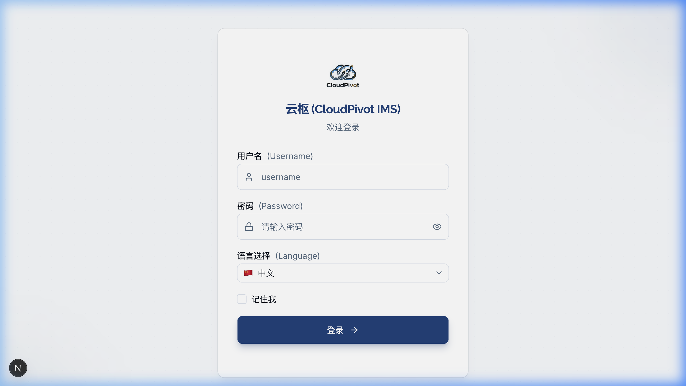

# 二、登录与首次设置

## 1. 登录页面

双击打开软件后，第一眼看到的就是这个蓝色背景的登录界面。每个人都必须输入自己的账号和密码才能进去干活。

### 1.1 界面上的按钮和输入框都是干啥的？

*   **输入框1：用户名**：
    *   也就是你的“工号”或“登录账号”（比如管理员就是 `admin`）。
    *   **怎么操作**：用鼠标左键点一下这个输入框，看到有光标闪烁，就可以用键盘输入字母了。
*   **输入框2：密码**：
    *   **怎么操作**：点一下输入框输入密码。输入的时候密码会变成黑色小圆点（******），防止旁边的人偷看。
    *   **小妙招**：如果输完怕打错，可以用鼠标点一下输入框右边那个**「小眼睛」**图标。点一下，密码就会显现出来；再点一下，又会藏起来。
*   **下拉框：选择语言**：
    *   **怎么操作**：如果你是中国管理人员，点一下它选择“🇨🇳 简体中文”；如果是越南员工，点一下选择“🇻🇳 Tiếng Việt”。选好后，界面上的字会立刻变成能看懂的语言。
*   **小方框：记住我**：
    *   **怎么操作**：用鼠标点一下这个小方框，里面会出现一个对勾。
    *   **有什么用**：勾选后，下一次你打开电脑用这个软件时，它会记住你，**不需要你每次都打字输入密码**，直接就能进系统，省时间！
*   **大按钮：登录**：
    *   输好用户名和密码后，用鼠标点一下这个蓝色的大按钮（或者在键盘上敲一下回车键 `Enter`），就能进系统了。按钮在转圈的时候代表正在连接云端，请耐心等 1-2 秒，不要重复去点。

### 1.2 登录要注意的安全规则（新手必看）

1.  **别把密码试错超过 5 次！**
    *   为了防止别人乱猜你的密码，如果**连续输错 5 次**，你的账号就会被系统锁死。
    *   锁死后界面会红字提示你：“账号已被锁定，请在 15 分钟后再试”。这时候急着干活的话，只能找厂里的最高管理员（admin）在后台帮你“解锁”才能重新登录。
2.  **改密码后，其他电脑会自动退出来**：
    *   如果你在自己的电脑上改了密码，为了安全，其他所有用你这个账号登录的设备（比如你的另外一台电脑或者同事的设备）在下次发起操作时会自动失效并退出，弹回到登录页，必须用新密码重新登（基于安全会话版本验证机制）。

---

## 2. 第一次登录被要求“修改密码”怎么办？

如果你的账号是网管刚给你建的，或者网管帮你重置了密码，你第一次登录进去后，屏幕上会自动弹出一个“必须修改密码”的页面。这个时候你不能点别的页面，必须先改好密码。

### 2.1 怎么改密码？

*   **第一步**：在“当前密码”里输入刚才登录成功的密码（比如初始密码 `abc12345`）。
*   **第二步**：在“新密码”里输入你想设的新密码。
    *   *注意*：新密码**要超过 6 位**，而且里面既要有字母，也要有数字。不要求大小写都有。纯数字（比如 `1234567`）会报错。
*   **第三步**：在“确认新密码”里把新密码再打一遍。如果打错了、和上面对不上，输入框底下会出现红字提示你。
*   **第四步**：点“确认修改”按钮。改好后系统会提示“修改成功”，并自动退回到登录页，你用刚刚设好的新密码重新登录一次就行了。

---

## 3. 第一次使用向导（新工厂开荒）

当整个工厂第一天用这个软件，最高管理员 `admin` 改完密码登录后，会看到一个“初始化向导”，一步步带你把工厂的基本信息建起来。一共 4 步：

### 3.1 第一步：填厂子信息
*   **企业名称**：把我们工厂的名字填进去（比如：越南云枢家具责任有限公司）。以后打印送货单时，抬头就会自动印这个名字。
*   **税号**：把厂里的税号填进去，方便记账。

### 3.2 第二步：建仓库
软件里必须有仓库，我们买进来的木板才晓得往哪里堆。
*   **最省事的方法**：用鼠标点一下**「一键初始化默认仓」**按钮。电脑会自动帮你建好“原材料仓”、“成品仓”和“半成品仓”，免去你一个字一个字去敲，非常方便！

### 3.3 第三步：导入货品（可以先跳过）
如果你手上有以前用 Excel 登记的货品表格，可以点「上传文件」导进来。如果觉得麻烦，可以直接点右下角的**「跳过此步」**，以后我们进系统再慢慢录入。

### 3.4 第四步：完成
确认前几步填的信息无误，点击“确认并启用系统”，向导就完成了。以后再打开软件，就直接进首页，再也不会弹出这个向导了。
��台创建新账户时勾选了“首次登录强制改密”，或者系统管理员重置了用户的密码，用户在输入原密码登录成功后，系统会**强制重定向**到“修改密码”页面，此时用户无法通过点击侧边栏或输入路由跳过此步骤。

### 2.1 界面元素与功能点说明

*   **当前密码输入框**：
    *   输入本次登录成功的旧密码（如初始密码 `admin123`）。
*   **新密码输入框**：
    *   **长度限制**：须超过 6 位。
    *   **复杂度要求**：必须同时包含字母和数字，不区分大小写。
*   **确认新密码输入框**：
    *   重新输入一遍新密码。
    *   **实时校验**：若两次输入的新密码不一致，按钮置灰且输入框底部红色字样实时报错：“两次输入的密码不一致”。
*   **确认修改按钮**：
    *   点击后保存。保存成功会弹出 Toaster 绿色通知：“密码修改成功，请重新登录”，并在 1.5 秒后自动跳回登录页。

---

## 3. 首次使用向导 (Setup Wizard)

当系统管理员 `admin` 首次成功登录并改密后，如果系统检测到数据库中为空（如未录入企业名称、无任何基础仓库等），会自动进入**“初始化向导”**流程。

向导分为 4 个步骤，界面顶部包含 `[① 企业信息] -> [② 创建基础仓库] -> [③ 导入基础数据] -> [④ 完成]` 的步骤进度条。

### 3.1 步骤一：企业信息设置

*   **企业名称（必填）**：
    *   输入企业的法定全称。此项为单值录入，作为系统在打印各种采购单、销售单、对账单时的全局页头企业抬头。可输入中/英/越任何语言，打印时按录入格式原样输出。
*   **默认系统语言**：
    *   选择系统默认初始语言。
*   **联系地址**与**联系电话**：
    *   填写企业的物理地址与联系方式。
*   **MST 税号 (Mã số thuế)**：
    *   越南本地企业的必备税号，仅支持 10 位（总公司）或 13 位（分公司）数字格式，校验不符合将报错提示。

### 3.2 步骤二：创建基础仓库

系统必须拥有仓库才能承载出入库流水，因此在此步骤要求强制至少创建一个“原材料仓”和一个“成品仓”。

*   **一键初始化默认仓按钮**：
    *   点击此按钮，系统会自动创建：
        1.  `原材料仓 (Raw Material Warehouse)`
        2.  `成品仓 (Finished Goods Warehouse)`
        3.  `半成品仓 (Semi-finished Warehouse)`
    *   这些生成的仓库会自动绑定到系统的“业务默认仓映射关系”中，免去用户后续手动关联的繁琐。
*   **手动创建仓库表单**：
    *   若不使用一键生成，可在此步骤下的列表手动点击“+ 添加”，录入：仓库编码、仓库名称、仓库类型（原材料/半成品/成品/退货）。

### 3.3 步骤三：导入基础数据（可选）

为方便快速导入旧有 Excel 数据，系统提供免模板配置的快速导入助手。

*   **下载模板**：
    *   提供“物料期初模板.xlsx”的下载入口。
*   **上传并预览**：
    *   选择本地填好的 Excel 文件上传，系统会在页面下方显示表格预览，将匹配到的数据行显示出来，并将有格式错误、编码重复的行标注为红色背景，显示报错原因。
*   **跳过此步按钮**：
    *   如果需要后续在系统中手动录入，可直接点击“跳过此步”。

### 3.4 步骤四：完成并进入系统

向导最后一页会汇总前三步录入的所有数据摘要（企业名、税号、已建仓库数、待导入物料数）。

*   **确认并启用系统按钮**：
    *   点击后系统会将初始化状态写入数据库（`system_config` 表中标志位设为 `initialized=true`），从此应用正常启动将不再展示该向导，直接进入系统首页看板。
