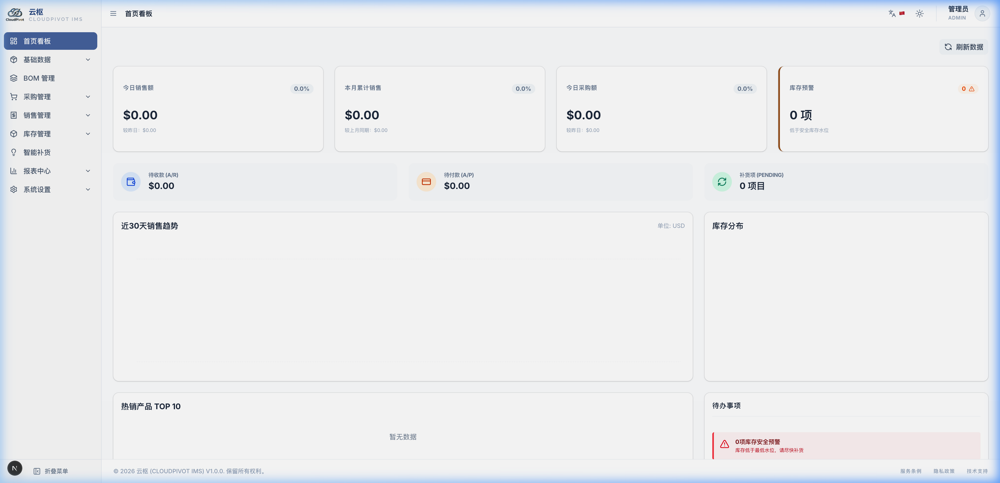

# 四、首页看板

“首页看板”是登录系统后看到的第一个页面，这里用一些简单的卡片和图表，把今天厂里卖了多少货、进了多少料、库房还剩多少钱的货等重要情况一次性告诉你，让你心里有个底。

---

## 1. 顶部六个数据卡片

这六个小卡片展示了最核心的数据。卡片上如果有**绿色向上箭头（▲）**，说明数据比昨天见好；如果有**红色向下箭头（▼）**，说明比昨天差。

### 1.1 今日销售额 (今天卖了多少钱)
*   **这是啥数**：今天（从夜里12点到现在）所有**已经确认发货**的销售单总共卖了多少钱。如果只开了销售单但货还没发出去，这个数字是不会计入的。
*   **点它有啥用**：你可以用鼠标点一下这个卡片，系统会直接帮你跳到销售单列表，并自动筛选出今天发货的所有销售单，让你看个明白。

### 1.2 本月销售额 (这个月累计卖了多少钱)
*   **这是啥数**：从本月1号到今天，一共发了多少钱的货。
*   **点它有啥用**：点一下直接跳到销售统计报表，帮你列出这个月每天的销售明细。

### 1.3 今日采购额 (今天买了多少钱的料)
*   **这是啥数**：今天收货入库的原材料一共值多少钱。只有库房确认收了货的才算，还在路上的不算。
*   **点它有啥用**：点一下会跳到采购入库单列表，展示今天所有收货的单据。

### 1.4 库存预警数 (仓库里有多少种料快没了或积压了)
*   **这是啥数**：可用库存低于安全备货量，或者高于最大存放量的货品种类数量。
    *   *可用库存* 就是厂里真正能动用的货。比如仓库里有 10 张木板，客户预定了 3 张，那可用库存就是 7 张。如果安全量是 8 张，这里就会标红拉警报！
*   **点它有啥用**：点一下直接带你到“智能补货”页面，去看看都是哪些材料不够了，方便采购去进货。

### 1.5 待收款总额 (客户还欠我们多少钱)
*   **这是啥数**：发货给客户但客户还没结清的货款总和。
*   **点它有啥用**：点一下直接去应收款界面，看看都是哪些客户赖账、欠了多久。

### 1.6 待付款总额 (我们还欠供应商多少钱)
*   **这是啥数**：我们收了供应商的材料但还没把钱付清的总和。
*   **点它有啥用**：点一下跳到应付款界面，看看该给谁结账了。

---

## 2. 两个核心图表怎么看？

### 2.1 30天销售与采购趋势图
*   这是一个波浪折线图，有两条线（一条代表销售卖货，一条代表采购买料）。
*   横坐标是过去的 30 天，纵坐标是金额。
*   **怎么看**：如果销售的那条线一直比采购的那条线高，说明我们厂最近销路不错，赚得比花得多。
*   **怎么操作**：把鼠标指针移到线上的点上，会弹出一个小黑框，显示那一天具体的销售额和采购额是多少。

### 2.2 库存分类金额占比饼图
*   这是一个圆形的“分蛋糕”饼图。它把仓库里所有的货按分类（如木材、五金、油漆）算钱，看哪类最值钱。
*   **怎么操作**：
    *   把鼠标移到扇区上，会显示这个分类占了仓库里百分之几的钱。
    *   **下钻操作（看更细）**：如果你点一下“木材”这一块，这个圆饼图会变成只显示“白橡板”、“红橡板”等具体木头材料在木材大类里的占比。点左上角的“返回”就能退回。

---

## 3. 右下角的待办提醒 (TodoList)

这里列出当前最紧急的几件事：
*   **缺料提醒**：比如提示“有 5 种原材料已经断货了”，右边会有一个蓝色的**「一键采购」**按钮。点一下它，系统会自动帮你把采购建议算好，直接开出买料的采购单草稿，连打字都免了。
*   **待审提醒**：提示你还有几张采购单、销售单被搁置在草稿状态，等你点进去审核。
