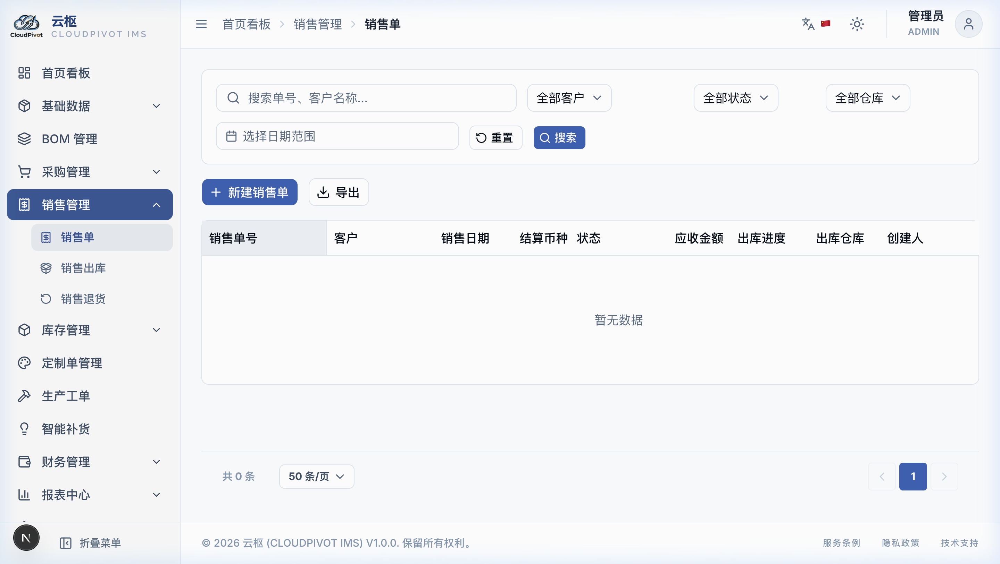
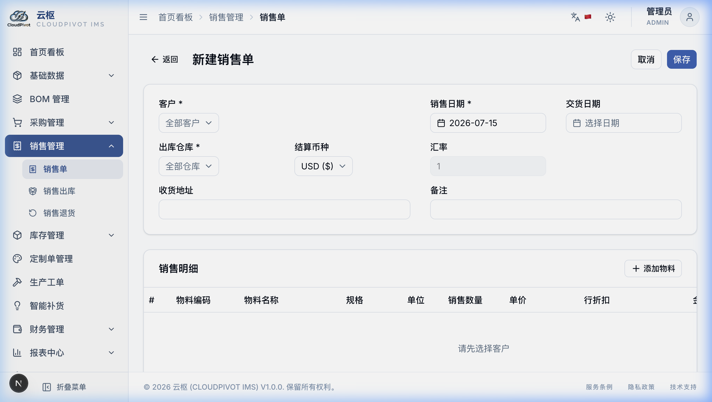
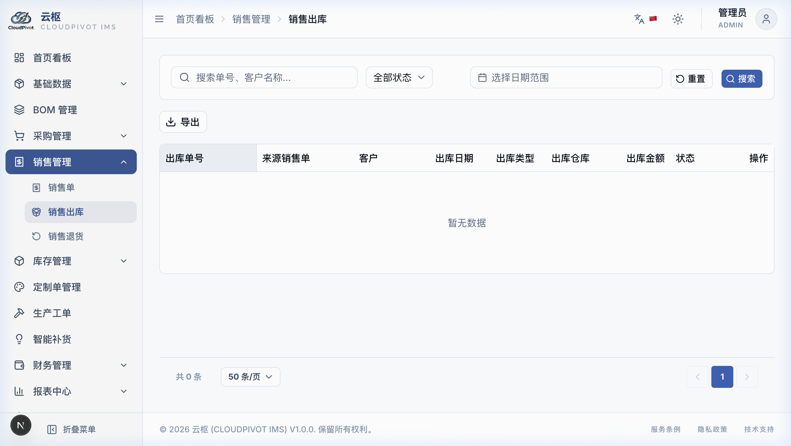

# 八、销售管理

销售管理就是记录我们向客户“卖产品”的过程。包含三步：**开销售单（订货合同） -> 仓库发货（办销售出库） -> 客户不满意退货（办理销售退货）**。

---

## 1. 销售单 (接客户订单)

销售单用来登记我们要卖什么产品给客户。

### 1.1 怎么开一张销售单？

1.  进入 **销售单** 列表，点右上角蓝色按钮**「+ 新建销售单」**。

2.  **选好客户**：
    *   在最上面选客户。系统会自动帮你把单子的币种换成跟客户结账的币种（如人民币或越南盾），并自动把他的收货地址带出来。
    *   如果我们在客户档案里给他设了“默认打 95 折 (折扣率写 5%)”，这里明细里的货品价格会自动打折，不用你手动去改价格。
3.  **选货品并输数量、算折扣**：
    *   在货品行选你要卖的家具，输入数量和单价。
    *   **行折扣**：如果单行要便宜，比如这一行便宜 10%，就打入 `10`。
    *   **整单折扣**：如果整张单子最后还要再折减，在最底下的“整单折扣”里填入比例即可。
    *   **总价自动计算**：
        *   应收总价 = 所有货品打完折的总额 - 整单折扣 + 运费 + 其他费用。

### 1.2 审核单子时的两道“硬防线”（新手必读）

当你点**「审核 (Approve)」**按钮发单时，电脑会在后台进行两个严格的自动检查：
*   **第一道防线：零库存不准卖！(零库存拦截)**：
    *   系统会自动去查这个库房里你要卖的这个家具还有没有货（可用库存）。
    *   如果仓库里这个家具的可用库存是 **0**，电脑会**坚决拦截，弹红色警告框**：“库存为零，无法审核发货”。你必须先让工厂生产或者进货。
*   **第二道防线：客户欠款超限报警！(信用额度预警)**：
    *   如果客户之前买货一直没付钱（欠款额很大），电脑会自动算出：“该客户当前的欠款总额 + 这张单子的总金额”。
    *   如果算出来的数**超过了该客户在户口本里设的信用额度**，电脑会弹出**黄色警告框**：“客户信用额度超限，当前欠款已达 XXX 元，是否强制发货？”。此时，必须点击确认强行通过，或者先去催客户付账。

---

## 2. 销售出库 (把货发出，记应收款)

审核通过后，仓库管理员需要办出库手续，把实物扣减掉。

### 2.1 怎么操作出库？

1.  进入 **销售出库单**，点击**「+ 关联销售单出库」**。
2.  双击选中那张已审核的销售单。系统会把货品清单带出来。
3.  **批次怎么分配？(先进先出规则)**：
    *   如果卖出的家具在进库时记了批次号，系统会非常聪明地按照**“谁先入库就先发谁 (FIFO 先进先出)”**的规律，自动帮你挑出最早进仓的批次数量。
    *   *你要换批次怎么办*：如果你去货位上拿货时，发现最早的那批被压在底下，拿不出来，你想拿最新入库的那批。你可以在出库单明细里的“批次”下拉框双击，**用鼠标手动选择你实际拿出来的那个批次**。你手动改了之后，系统会尊重你的决定，按你选的扣减库存。
4.  点确认出库，仓库物理库存扣减，财务账上自动记上一笔客户欠我们钱的“应收账款”。

### 2.2 出库时成本是怎么记的？(双轨成本固化)

为了方便老板查账算利润，发货的一瞬间，电脑会把这两个成本数字存进这张单子里：
1.  **标准成本**：就是这个家具按工艺配方（BOM表）算出来的理论材料成本。
2.  **实际成本**：就是用这个仓库里当前所有这批货的移动平均进价成本算的实际价格。
两个数据同时保留，以后查利润报表时，可以随便切换着看！

---

## 3. 销售退货 (客户把货退回来了)

如果客户退货回来：

1.  退货必须**关联原来的销售出库单**，不能平空退货。
2.  退回的货，必须退回到它原来发货时记录的那个批次中去。
3.  **库存成本怎么算？(原单快照继承)**：
    *   退货回仓库时，增加的库存单价**绝不采用仓库当前可能已经被其他货品稀释过的移动平均成本**，而是**死死锁死并继承这批货发出去时记录的成本**，避免退货搞乱我们仓库里原有的材料成本单价。
4.  **退货冲减金额怎么算？(折后比例倒算)**：
    *   退货金额不是按"原价 × 退货数量"来算的，而是按**原出库行的实际折后金额，按退货数量占出库数量的比例来分摊**。
    *   *公式*：`退货行冲减金额 = 原出库行折后金额 × (退货数量 ÷ 原出库数量)`
    *   *举例*：假设原出库单卖出 10 把椅子，行折后金额共 900 元（已含行折扣）。客户只退其中 3 把，那退货冲减金额 = 900 × (3 ÷ 10) = **270 元**，而不是按单价单独重算，这样能保证折扣口径前后一致。
    *   **尾差处理**：若同一出库行分多次零星退货，最后一笔退货会自动用"剩余应退总额"倒挤，彻底消除分摊产生的分厘尾差，账目精确无误。
    *   退货确认后，财务账上会自动生成一笔**负数调整账**，把客户欠我们的钱按上述金额扣减掉，账目一清二楚！
