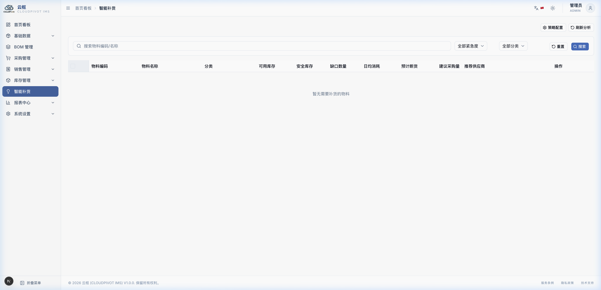

# 十一、智能补货 (买料建议)

这个模块就像是厂里的“补货大管家”。它能根据厂里平时每天消耗多少料、供应商送货要几天、以及仓库里现在还剩多少可用库存，自动帮你算出来：**哪些料快断货了、该找谁买、买多少最划算**。

---

## 1. 怎么看懂电脑给的采购建议？

进入 **智能补货** 页面，电脑会自动列出需要买货的材料明细。

### 1.1 列表里的核心数据代表啥？

*   **日均消耗量**：系统自动看过去 90 天里，车间每天平均要领用掉多少这个料（比如每天用掉 5 张白橡木板）。
*   **预计断货天数 (最直观的催命指标！)**：
    *   *怎么算*：`可用库存 ÷ 日均消耗量`。
    *   **颜色代表紧急程度**：
        *   **深红背景 + 「已断货」**：已经没料了！而且现在有未发货的订单正等着要这个料，必须立刻马上去买！
        *   **橙色背景 + 「极度紧急」**：料只够用 1 到 7 天了，再不买下周就要停工了！
*   **推荐供应商与参考进价**：自动带出你在供应商档案里勾选的那个“首选供应商”和最新的报价。
*   **建议采购量**：电脑自动帮你算好的最佳买货数量。

---

## 2. 它是怎么帮我们算“买多少”的？

在页面右上角点击**「策略配置」**按钮，你会看到几个设置框，我们可以用大白话来理解它们：

| 选项名称 | 默认值 | 意思是什么？（大白话打个比方） |
|:---|:---|:---|
| **补货周期 (天数)** | `7` 天 | **买货在路上走的时间**。从我们给供应商下单，到供应商把货送到厂里，平均要花几天。 |
| **安全天数** | `3` 天 | **备用天数**。怕供应商路上堵车延误、或者厂里突然来急单，多预留几天的干货存量。 |
| **批量倍数** | `1` | **整箱整包购买的对齐数**。比如某种螺丝一箱是 50 个，不拆散卖。把倍数设为 50，如果算出来需要 82 个，电脑会自动把建议量进位成 `100`（即 2 箱）。 |

### 2.1 电脑的计算公式（用买馒头打比方）：

你想买多少馒头，取决于：`（你每天吃几个 × (快递送几天 + 备用几天)） - 冰箱里还剩几个 + 冰箱里必须存着的底数`。

**建议采购量 = （日均消耗量 × (补货周期 + 安全天数)） - 可用库存 + 安全库存**

---

## 3. 一键生成采购单 (最省事的功能)

采购员不用自己对照着单子一个个输入货品和价格：

1.  在补货列表里，把你想买货的几行料前面的**小方框勾选上**（可以跨供应商多选）。
2.  点列表上面的蓝色大按钮：**「一键生成采购单」**。
3.  **电脑自动帮你分家 (自动拆单)！**：
    *   *例子*：你勾了 5 种料，其中 3 种是找 A 供应商买，2 种是找 B 供应商买。
    *   *结果*：点完后，**电脑会自动帮你开出 2 张采购单草稿**（一张写着 A 供应商，一张写着 B 供应商），里面已经把货品名、单价和数量都填好了。
4.  你可以点击弹出的采购单链接，进去做最后核对，点一下审核，订货就完成了！
