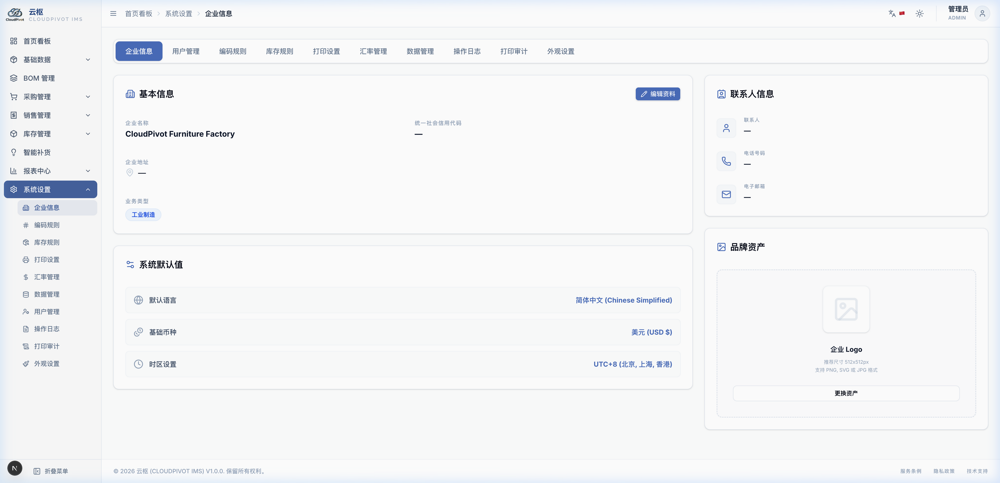
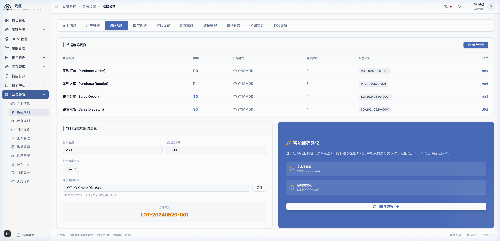
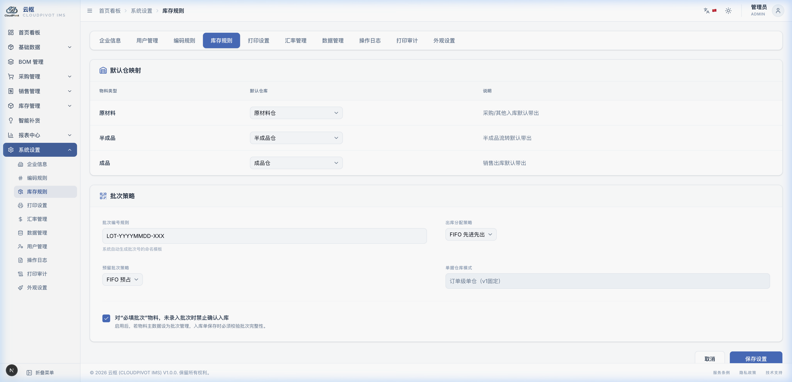
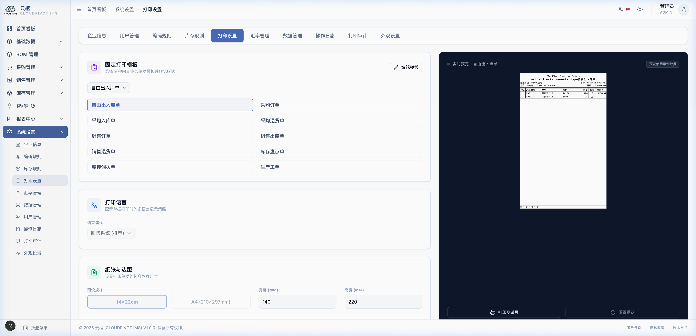
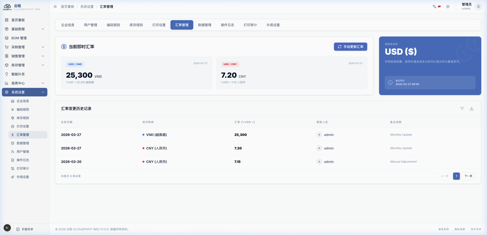
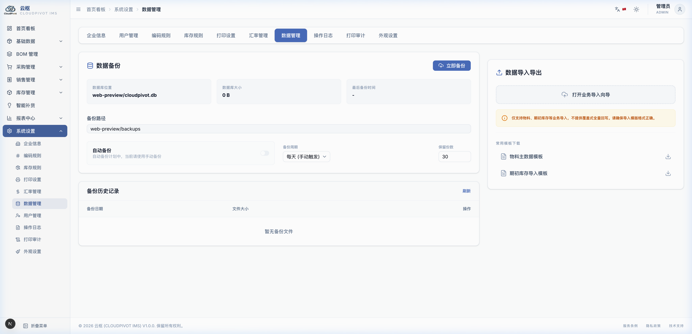
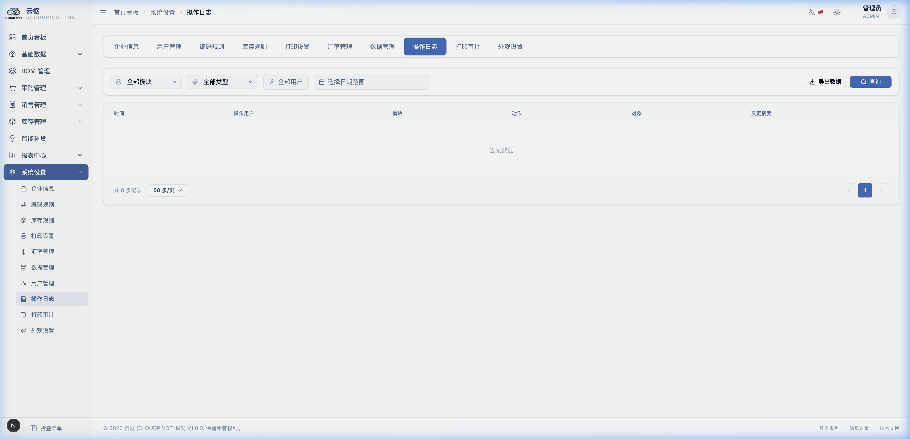
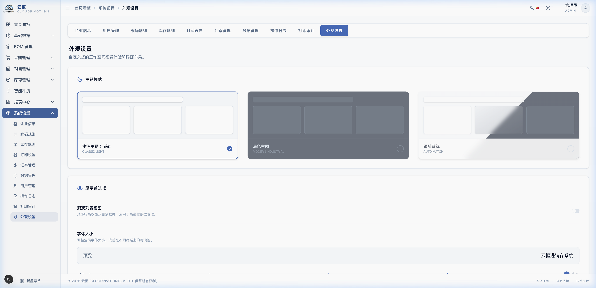

# 十四、系统设置 (系统大管家)

这里是修改软件基本规则的“中央控制台”。通常由厂长、主管或网管来操作。普通员工只要看看了解就行了。

---

## 1. 各个设置页签都有什么用？

### 1.1 企业信息 (厂名和Logo)
*   **厂子名字**：打入我们厂的法定全名。以后打印送货单时，最上面的厂名抬头就是从这儿来的。
*   **上传 Logo**：上传一张我们厂的图片（只支持 `.png` 格式）。印单子时会自动把我们的 Logo 印在左上角。

### 1.2 编码规则 (单号怎么排？)

*   **单据编码自定义**：
    *   你可以决定买货单（PO）、卖货单（SO）、收货单（PI）的开头字母。
    *   *比如*：采购单你想改成 `CG-` 开头，日期想要 `YYYYMMDD`（如 `20260715`），后面要 3 位流水号（如 `-001`）。
    *   **实时看样子**：你在改的时候，输入框底下会实时显示出单号的样子（如 `CG-20260715-001`）。看顺眼了再点保存。

### 1.3 库存规则 (进出仓默认去哪？)

*   **默认仓库设置**：
    *   在这里设置好：原材料默认送进“原材料仓”，半成品默认进“半成品仓”，成品家具默认进“成品仓”。
    *   *好处*：以后大家开单子录货时，系统会自动帮你填好仓库，不用录单员每次都去选，省事而且不会选错仓库！

### 1.4 打印设置 (双语打印怎么配？)

*   **打印双语选择**：
    *   为了适应中越工厂，我们在打印送货单时，可以选“固定双语”。
    *   **最佳组合**：主语言选“中文”，次语言选“越南语”。这样打印出来的单据，表头和货品单位就会同时有中文和越南文，中越工人都能看懂，不容易搬错货。
*   **纸张大小和边距**：
    *   可选 A4、A5 纸。如果用的是针式打印机，可以选“自定义”，手动填入我们买的纸张宽度和高度（以毫米 mm 为单位）。

### 1.5 汇率管理 (怎么记今天的美元汇率？)

*   **汇率记账规则**：
    *   我们系统以**美元 (USD)** 为基准。财务需要在这里填今天人民币和越南盾的汇率（比如 `1 美元 = 25,300 越南盾`，直接输 `25300`）。
*   **汇率历史防变动铁律**：
    *   你每次修改汇率，旧的汇率都会被存进历史账本里，不会被覆盖。
    *   **为什么这样做**：*比如*你上个月开的采购单汇率是 25,200，今天最新汇率是 25,300。你查上个月账时，**电脑会死死锁定上个月的汇率**，绝对不会跟着今天的汇率变，防止历史账目发生混乱。

### 1.6 数据管理 (备份和防止货丢)

*   **立即备份按钮**：
    *   点击「立即备份」，电脑会自动把所有的账目、物料、单子打包存成一个安全文件。**建议厂里每周点一下**，万一电脑被泼了水或者坏了，能用备份找回所有数据。
*   **全量导出 Excel**：
    *   点一下可以把数据库里的所有货、所有供应商一次性倒进一个巨大的 Excel 表格里，你可以拿回家慢慢看。

### 1.7 操作日志 (谁背锅？)

*   系统会自动用铁笔头记录下谁在什么时候干了什么敏感操作。
*   *比如*：谁改了汇率、谁在几点把某张采购单删除了、谁改了密码。日志记录里会清清楚楚写着：`操作人: 张三，修改了单据 PO-20260715-001 的运费从 200 变到 500`。想赖账是不可能的。

### 1.8 外观设置

*   觉得白色刺眼？点一下「深色主题」，界面瞬间变黑，适合晚上加班或者视力不太好的人用。
