<!-- START OF README.md -->
# 云枢 CloudPivot IMS — 傻瓜式操作手册

> **版本**：v1.0 &nbsp;|&nbsp; **最后更新**：2026-07-15
>
> **这本手册是写给谁看的？**
> 专门为工厂的老板、主管、仓库管理员、采购和销售人员准备的。不管你以前有没有用过管理软件，只要你会用微信、会打字，看着这本手册一步步点，就一定能学会！

---

## 目录

本手册按照工厂平时的干活流程来分章节，大家可以按需要点击查看：

| 章节 | 这个章节教你干什么？ | 点击这里查看 |
|------|------|------|
| **一、系统概述与安装** | 认识这个软件，教你如何在电脑上安装 | 本文件（往下看） |
| **二、登录与首次设置** | 怎么登录、怎么改密码、第一次用怎么设置 | 02-login-and-setup.md |
| **三、界面布局** | 软件上这几个区域都是干嘛的，怎么点不迷路 | 03-layout.md |
| **四、首页看板** | 怎么一眼看清今天卖了多少钱、还有多少货 | 04-dashboard.md |
| **五、基础数据** | 怎么录入木材、五金件、建仓库、登记供应商和客户 | 05-base-data.md |
| **六、BOM 管理** | 怎么给一张桌子配“配料表”（需要多少料、多少螺丝） | 06-bom.md |
| **七、采购管理** | 怎么给供应商下采购单、货到了怎么入库、退货怎么办 | 07-purchase.md |
| **八、销售管理** | 怎么给客户开销售单、怎么发货出库、退货怎么退款 | 08-sales.md |
| **九、库存管理** | 怎么查库存、仓库盘点怎么记、两个仓库之间怎么调拨 | 09-inventory.md |
| **十、定制单与生产工单** | 定制家具怎么做、车间怎么领料、完工怎么进成品仓 *(暂未开放)* | 10-custom-and-production.md |
| **十一、智能补货** | 仓库快没料了，怎么让电脑自动算要买多少料 | 11-replenishment.md |
| **十二、财务管理** | 欠供应商多少钱、客户欠我们多少钱、怎么记收付款 *(暂未开放)* | 12-finance.md |
| **十三、报表中心** | 查账目明细、利润有多少、哪些料积压了 | 13-reports.md |
| **十四、系统设置** | 改厂名、改单据编号规则、改汇率和打印设置 | 14-settings.md |
| **十五、打印指南** | 怎么连打印机、怎么打印送货单（尤其是针式打印机） | 15-print-guide.md |
| **附录** | 常见问题解答 FAQ、工厂常用词语解释、好用的快捷键 | appendix.md |

---

## 一、系统概述

### 1.1 产品介绍

**云枢 (CloudPivot IMS)** 是专门为我们**越南家具工厂**开发的一套简单的电脑记账和库存管理软件。
用这个软件，你可以：
1. 清清楚楚记下每天买进多少原材料（木板、五金、油漆）。
2. 记下出库了多少成品家具，卖给哪些客户，赚了多少钱。
3. 随时用手机或电脑一查，就知道仓库里还剩几张板、几个拉手，再也不用大热天跑去仓库数数。
4. 软件支持**中文、越南语、英文**，厂里的中国管理人员和越南本地员工都可以用自己看得懂的文字操作，沟通再也不费劲！
5. 买货卖货支持直接记越南盾（VND）、人民币（CNY）或美元（USD），电脑会自动帮你折算。

### 1.2 系统要求

不需要特别贵的电脑，平时办公用的普通电脑就可以用：
*   **操作系统**：只要是 Windows 10、Windows 11 系统的电脑，或者苹果 Mac 电脑都可以。
*   **网络要求**：电脑需要联网，因为我们的数据都安全地保存在云端数据库里，只要联网，数据就不会丢。
*   **屏幕要求**：电脑屏幕分辨率建议稍微大一点，字能看得更清楚。

### 1.3 安装方法（非常简单，一步步来）

#### 💻 Windows 电脑安装（最常见的电脑）

1. 双击你下载好的安装文件：`CloudPivot-IMS_x.x.x_x64-setup.exe`。
2. 电脑如果弹出提示“是否允许此应用进行更改”，请用鼠标点击**「是」**。
3. 接下来一直点击**「下一步」**，直到最后出现**「完成」**按钮。
4. 安装好后，你的电脑桌面上会出现一个叫 **云枢 (CloudPivot IMS)** 的蓝色图标，用鼠标左键双击它就可以打开软件啦！

#### 🍎 苹果 Mac 电脑安装

由于我们的软件是专门定制的，没有在苹果商店上架，首次安装需要按照下面两步来做，不要慌：

1. 双击打开下载好的 `.dmg` 文件。
2. 用鼠标按住 **CloudPivot IMS** 的蓝色图标，往右边拖进 **Applications**（应用程序）文件夹里。
3. **关键的一步**：第一次打开时，**不要直接双击它**！请在 Finder（访达）里找到「应用程序」文件夹，找到 `CloudPivot IMS` 软件，**按住鼠标右键，在菜单里选择「打开」**，系统会弹出一个警告框，这时候再点击**「确认打开」**就行了。以后再打开，直接双击就可以了。
4. *如果双击还是打不开，并提示“已损坏，无法打开”*：
   别急！请让厂里的网管或会点电脑的人，在 Mac 电脑里找到一个叫“终端 (Terminal)”的黑窗口，把下面这行命令复制进去，然后按下回车键（Enter）即可修复：
   ```bash
   xattr -cr /Applications/CloudPivot\ IMS.app
   ```

#### 🔄 自动更新

这个软件非常聪明，每次你打开它，它都会在后台看看开发团队有没有发新版（比如修了什么问题、加了什么新表单）。如果有了新版，它会在右下角弹出一个气泡提示你，你只需要点一下“下载安装”，它就会自己装好并重新启动，不用你每次都手动去重装，省心省力！


<!-- END OF README.md -->


<div style="page-break-before: always;"></div>

<!-- START OF 02-login-and-setup.md -->
# 二、登录与首次设置

## 1. 登录页面

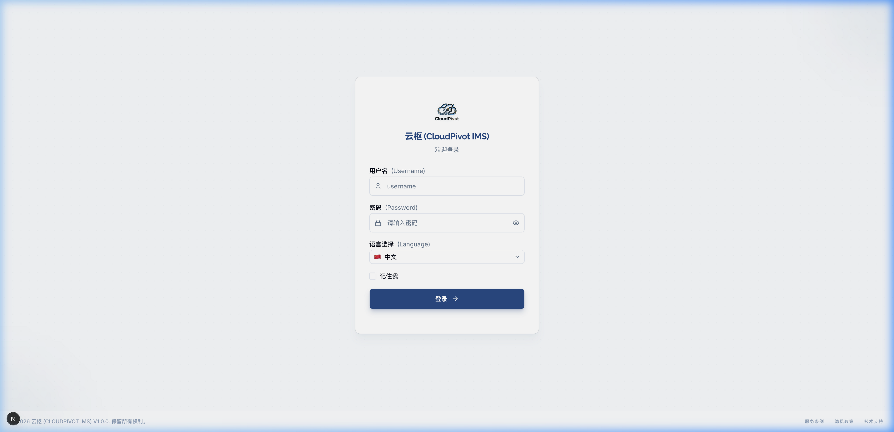

双击打开软件后，第一眼看到的就是这个蓝色背景的登录界面。每个人都必须输入自己的账号和密码才能进去干活。

### 1.1 界面上的按钮和输入框都是干啥的？

*   **输入框1：用户名**：
    *   也就是你的“工号”或“登录账号”（比如管理员就是 `admin`）。
    *   **怎么操作**：用鼠标左键点一下这个输入框，看到有光标闪烁，就可以用键盘输入字母了。
*   **输入框2：密码**：
    *   **怎么操作**：点一下输入框输入密码。输入的时候密码会变成黑色小圆点（******），防止旁边的人偷看。
    *   **小妙招**：如果输完怕打错，可以用鼠标点一下输入框右边那个**「小眼睛」**图标。点一下，密码就会显现出来；再点一下，又会藏起来。
*   **下拉框：选择语言**：
    *   **怎么操作**：如果你是中国管理人员，点一下它选择“🇨🇳 简体中文”；如果是越南员工，点一下选择“🇻🇳 Tiếng Việt”。选好后，界面上的字会立刻变成能看懂的语言。
*   **小方框：记住我**：
    *   **怎么操作**：用鼠标点一下这个小方框，里面会出现一个对勾。
    *   **有什么用**：勾选后，下一次你打开电脑用这个软件时，它会记住你，**不需要你每次都打字输入密码**，直接就能进系统，省时间！
*   **大按钮：登录**：
    *   输好用户名和密码后，用鼠标点一下这个蓝色的大按钮（或者在键盘上敲一下回车键 `Enter`），就能进系统了。按钮在转圈的时候代表正在连接云端，请耐心等 1-2 秒，不要重复去点。

### 1.2 登录要注意的安全规则（新手必看）

1.  **别把密码试错超过 5 次！**
    *   为了防止别人乱猜你的密码，如果**连续输错 5 次**，你的账号就会被系统锁死。
    *   锁死后界面会红字提示你：“账号已被锁定，请在 15 分钟后再试”。这时候急着干活的话，只能找厂里的最高管理员（admin）在后台帮你“解锁”才能重新登录。
2.  **改密码后，其他电脑会自动退出来**：
    *   如果你在自己的电脑上改了密码，为了安全，其他所有用你这个账号登录的设备（比如你的另外一台电脑或者同事的设备）会在 5 秒钟内自动退出，弹回到登录页，必须用新密码重新登。

---

## 2. 第一次登录被要求“修改密码”怎么办？

如果你的账号是网管刚给你建的，或者网管帮你重置了密码，你第一次登录进去后，屏幕上会自动弹出一个“必须修改密码”的页面。这个时候你不能点别的页面，必须先改好密码。

### 2.1 怎么改密码？

*   **第一步**：在“当前密码”里输入刚才登录成功的密码（比如 `admin123`）。
*   **第二步**：在“新密码”里输入你想设的新密码。
    *   *注意*：新密码**至少要有 8 个字符**，而且里面既要包含数字，也要包含英文字母的大写和小写。不能设得太简单（比如 `12345678` 会报错）。
*   **第三步**：在“确认新密码”里把新密码再打一遍。如果打错了、和上面对不上，输入框底下会出现红字提示你。
*   **第四步**：点“确认修改”按钮。改好后系统会提示“修改成功”，并自动退回到登录页，你用刚刚设好的新密码重新登录一次就行了。

---

## 3. 第一次使用向导（新工厂开荒）

当整个工厂第一天用这个软件，最高管理员 `admin` 改完密码登录后，会看到一个“初始化向导”，一步步带你把工厂的基本信息建起来。一共 4 步：

### 3.1 第一步：填厂子信息
*   **企业名称**：把我们工厂的名字填进去（比如：越南云枢家具责任有限公司）。以后打印送货单时，抬头就会自动印这个名字。
*   **税号**：把厂里的税号填进去，方便记账。

### 3.2 第二步：建仓库
软件里必须有仓库，我们买进来的木板才晓得往哪里堆。
*   **最省事的方法**：用鼠标点一下**「一键初始化默认仓」**按钮。电脑会自动帮你建好“原材料仓”、“成品仓”和“半成品仓”，免去你一个字一个字去敲，非常方便！

### 3.3 第三步：导入货品（可以先跳过）
如果你手上有以前用 Excel 登记的货品表格，可以点「上传文件」导进来。如果觉得麻烦，可以直接点右下角的**「跳过此步」**，以后我们进系统再慢慢录入。

### 3.4 第四步：完成
确认前几步填的信息无误，点击“确认并启用系统”，向导就完成了。以后再打开软件，就直接进首页，再也不会弹出这个向导了。
��台创建新账户时勾选了“首次登录强制改密”，或者系统管理员重置了用户的密码，用户在输入原密码登录成功后，系统会**强制重定向**到“修改密码”页面，此时用户无法通过点击侧边栏或输入路由跳过此步骤。

### 2.1 界面元素与功能点说明

*   **当前密码输入框**：
    *   输入本次登录成功的旧密码（如初始密码 `admin123`）。
*   **新密码输入框**：
    *   **长度限制**：最少 8 位，最多 32 位字符。
    *   **复杂度要求**：必须同时包含数字、小写字母、大写字母。
*   **确认新密码输入框**：
    *   重新输入一遍新密码。
    *   **实时校验**：若两次输入的新密码不一致，按钮置灰且输入框底部红色字样实时报错：“两次输入的密码不一致”。
*   **确认修改按钮**：
    *   点击后保存。保存成功会弹出 Toaster 绿色通知：“密码修改成功，请重新登录”，并在 1.5 秒后自动跳回登录页。

---

## 3. 首次使用向导 (Setup Wizard)

当系统管理员 `admin` 首次成功登录并改密后，如果系统检测到数据库中为空（如未录入企业名称、无任何基础仓库等），会自动进入**“初始化向导”**流程。

向导分为 4 个步骤，界面顶部包含 `[① 企业信息] -> [② 创建基础仓库] -> [③ 导入基础数据] -> [④ 完成]` 的步骤进度条。

### 3.1 步骤一：企业信息设置

*   **企业名称（必填）**：
    *   输入企业的法定全称。此项为单值录入，作为系统在打印各种采购单、销售单、对账单时的全局页头企业抬头。可输入中/英/越任何语言，打印时按录入格式原样输出。
*   **默认系统语言**：
    *   选择系统默认初始语言。
*   **联系地址**与**联系电话**：
    *   填写企业的物理地址与联系方式。
*   **MST 税号 (Mã số thuế)**：
    *   越南本地企业的必备税号，仅支持 10 位（总公司）或 13 位（分公司）数字格式，校验不符合将报错提示。

### 3.2 步骤二：创建基础仓库

系统必须拥有仓库才能承载出入库流水，因此在此步骤要求强制至少创建一个“原材料仓”和一个“成品仓”。

*   **一键初始化默认仓按钮**：
    *   点击此按钮，系统会自动创建：
        1.  `原材料仓 (Raw Material Warehouse)`
        2.  `成品仓 (Finished Goods Warehouse)`
        3.  `半成品仓 (Semi-finished Warehouse)`
    *   这些生成的仓库会自动绑定到系统的“业务默认仓映射关系”中，免去用户后续手动关联的繁琐。
*   **手动创建仓库表单**：
    *   若不使用一键生成，可在此步骤下的列表手动点击“+ 添加”，录入：仓库编码、仓库名称、仓库类型（原材料/半成品/成品/退货）。

### 3.3 步骤三：导入基础数据（可选）

为方便快速导入旧有 Excel 数据，系统提供免模板配置的快速导入助手。

*   **下载模板**：
    *   提供“物料期初模板.xlsx”的下载入口。
*   **上传并预览**：
    *   选择本地填好的 Excel 文件上传，系统会在页面下方显示表格预览，将匹配到的数据行显示出来，并将有格式错误、编码重复的行标注为红色背景，显示报错原因。
*   **跳过此步按钮**：
    *   如果需要后续在系统中手动录入，可直接点击“跳过此步”。

### 3.4 步骤四：完成并进入系统

向导最后一页会汇总前三步录入的所有数据摘要（企业名、税号、已建仓库数、待导入物料数）。

*   **确认并启用系统按钮**：
    *   点击后系统会将初始化状态写入数据库（`system_config` 表中标志位设为 `initialized=true`），从此应用正常启动将不再展示该向导，直接进入系统首页看板。

<!-- END OF 02-login-and-setup.md -->


<div style="page-break-before: always;"></div>

<!-- START OF 03-layout.md -->
# 三、界面布局

打开软件进入主界面后，主要分为两个区域：**左侧的“菜单栏”** 和 **右侧的“操作内容区”**。我们通过左侧选不同的菜单，右侧就会显示不同的工作表格。

---

## 1. 左侧菜单栏 (Sidebar)

这是我们切换功能的主入口。

### 1.1 菜单栏变窄与展开 (折叠功能)

为了让右边的表格看得更宽敞，菜单栏支持折叠：
*   **折叠按钮**：在菜单栏的最下面或者左上角 Logo 旁边，有一个小箭头按钮。点一下它，菜单栏就会**缩得很窄**，只显示一个个小图标。
*   **缩窄后的提示**：如果缩窄了你不认识图标是干啥的，不用担心，把鼠标指针移到图标上放一下（不要点），右边会自动冒出一个绿底白字的气泡框（Tooltip），告诉你这是什么菜单（比如“物料管理”）。
*   **展开菜单**：再点一下那个小箭头按钮，菜单栏又会变宽，把文字和图标都露出来。

### 1.2 菜单的上下展开和变蓝高亮

*   **大类展开**：有些菜单（如“基础数据”）右边有一个向下的小三角（▼）。用鼠标点它一下，它下面藏着的具体菜单（物料管理、分类管理、供应商等）就会像拉抽屉一样向下滑动露出来。再点一次就收回去。
*   **高亮指示**：你现在在哪个页面干活，左边对应的那个菜单项背景就会**变成蓝色**。即便菜单栏缩窄了，对应的那个小图标依然会是蓝色的，让你随时知道自己在哪，不会迷路。

### 1.3 权限裁剪 (不该看的不显示)

根据你登录账号的角色，左边的菜单是会自动变少或变多的，不要以为是坏了：
*   **普通库管/采购员**：你看不到“系统设置”和“用户管理”菜单。
*   **只读账号（查看者）**：你能看到很多菜单，但是页面里的“新增”、“修改”、“删除”和“审核”等按钮全都是**置灰不可点**的，或者直接隐藏了，你只能看不能改。

---

## 2. 顶部工具栏 (Header)

在每个页面的正上方，有一条固定的白色或深色窄栏，这里有几个随时能用的小工具：

### 2.1 界面元素与大白话说明

*   **侧边栏三横线按钮**：最左边的三条横线按钮。点一下可以把左侧菜单栏彻底隐藏起来，再点一下露出来。在小屏幕的笔记本上干活时，用它隐藏菜单栏能看更多数据。
*   **面包屑路标 (Breadcrumbs)**：
    *   在顶部左侧，会用类似 `基础数据 > 物料管理 > 新增` 的字样，像路标一样告诉你现在在哪。
    *   **快捷返回**：路标里的前几项是可以点超链接的。比如你在“新增物料”页面，不用点左边的菜单，直接点一下路标里的“物料管理”，就能瞬间退回到物料列表，非常快捷！
*   **国旗图标 (语言切换下拉框)**：
    *   在右上角，显示着当前国家的国旗（🇨🇳 简体中文 / 🇻🇳 越南语 / 🇺🇸 英语）。如果厂里的越南工人要用，点一下国旗换成越南国旗，全软件所有的字瞬间就都变成越南文了。
*   **太阳/月亮图标 (黑白主题切换)**：
    *   点一下可以切换界面的亮度。白天用太阳图标（亮白色），眼睛累了或者晚上加班可以用月亮图标（深色护眼模式）。
*   **人名和头像 (个人中心)**：
    *   在最右上角，显示着你的登录名字。用鼠标点一下它，会弹出一个下拉小菜单：
        1.  **修改密码**：可以直接去改你本人的登录密码。
        2.  **关于系统**：点一下能看到这个软件是什么版本，以及我们的数据库是不是连着的。如果软件用着卡，可以点这里面的“检查更新”看看是不是有新版本。
        3.  **退出登录**：下班了或者不想给别人用你的电脑时，点它，确认后软件会退回到最开始的登录界面，安全锁定。

<!-- END OF 03-layout.md -->


<div style="page-break-before: always;"></div>

<!-- START OF 04-dashboard.md -->
# 四、首页看板

“首页看板”是登录系统后看到的第一个页面，这里用一些简单的卡片和图表，把今天厂里卖了多少货、进了多少料、库房还剩多少钱的货等重要情况一次性告诉你，让你心里有个底。


---

## 1. 顶部六个数据卡片

这六个小卡片展示了最核心的数据。卡片上如果有**绿色向上箭头（▲）**，说明数据比昨天见好；如果有**红色向下箭头（▼）**，说明比昨天差。

### 1.1 今日销售额 (今天卖了多少钱)
*   **这是啥数**：今天（从夜里12点到现在）所有**已经确认发货**的销售单总共卖了多少钱。如果只开了销售单但货还没发出去，这个数字是不会计入的。
*   **点它有啥用**：你可以用鼠标点一下这个卡片，系统会直接帮你跳到销售单列表，并自动筛选出今天发货的所有销售单，让你看个明白。

### 1.2 本月销售额 (这个月累计卖了多少钱)
*   **这是啥数**：从本月1号到今天，一共发了多少钱的货。
*   **点它有啥用**：点一下直接跳到销售统计报表，帮你列出这个月每天的销售明细。

### 1.3 今日采购额 (今天买了多少钱的料)
*   **这是啥数**：今天收货入库的原材料一共值多少钱。只有库房确认收了货的才算，还在路上的不算。
*   **点它有啥用**：点一下会跳到采购入库单列表，展示今天所有收货的单据。

### 1.4 库存预警数 (仓库里有多少种料快没了或积压了)
*   **这是啥数**：可用库存低于安全备货量，或者高于最大存放量的货品种类数量。
    *   *可用库存* 就是厂里真正能动用的货。比如仓库里有 10 张木板，客户预定了 3 张，那可用库存就是 7 张。如果安全量是 8 张，这里就会标红拉警报！
*   **点它有啥用**：点一下直接带你到“智能补货”页面，去看看都是哪些材料不够了，方便采购去进货。

### 1.5 待收款总额 (客户还欠我们多少钱)
*   **这是啥数**：发货给客户但客户还没结清的货款总和。
*   **点它有啥用**：点一下直接去应收款界面，看看都是哪些客户赖账、欠了多久。

### 1.6 待付款总额 (我们还欠供应商多少钱)
*   **这是啥数**：我们收了供应商的材料但还没把钱付清的总和。
*   **点它有啥用**：点一下跳到应付款界面，看看该给谁结账了。

---

## 2. 两个核心图表怎么看？

### 2.1 30天销售与采购趋势图
*   这是一个波浪折线图，有两条线（一条代表销售卖货，一条代表采购买料）。
*   横坐标是过去的 30 天，纵坐标是金额。
*   **怎么看**：如果销售的那条线一直比采购的那条线高，说明我们厂最近销路不错，赚得比花得多。
*   **怎么操作**：把鼠标指针移到线上的点上，会弹出一个小黑框，显示那一天具体的销售额和采购额是多少。

### 2.2 库存分类金额占比饼图
*   这是一个圆形的“分蛋糕”饼图。它把仓库里所有的货按分类（如木材、五金、油漆）算钱，看哪类最值钱。
*   **怎么操作**：
    *   把鼠标移到扇区上，会显示这个分类占了仓库里百分之几的钱。
    *   **下钻操作（看更细）**：如果你点一下“木材”这一块，这个圆饼图会变成只显示“白橡板”、“红橡板”等具体木头材料在木材大类里的占比。点左上角的“返回”就能退回。

---

## 3. 右下角的待办提醒 (TodoList)

这里列出当前最紧急的几件事：
*   **缺料提醒**：比如提示“有 5 种原材料已经断货了”，右边会有一个蓝色的**「一键采购」**按钮。点一下它，系统会自动帮你把采购建议算好，直接开出买料的采购单草稿，连打字都免了。
*   **待审提醒**：提示你还有几张采购单、销售单被搁置在草稿状态，等你点进去审核。

<!-- END OF 04-dashboard.md -->


<div style="page-break-before: always;"></div>

<!-- START OF 05-base-data.md -->
# 五、基础数据管理

“基础数据”就是我们厂里各种木板、拉手、螺丝和客户供应商的“户口本”。第一次用软件时，我们得把这些信息录好，以后开单子直接选就行了，不用每次都用键盘打字输入。

---

## 1. 物料管理 (货品和材料登记)

这里登记厂里所有的原材料、半成品和做好的家具成品。

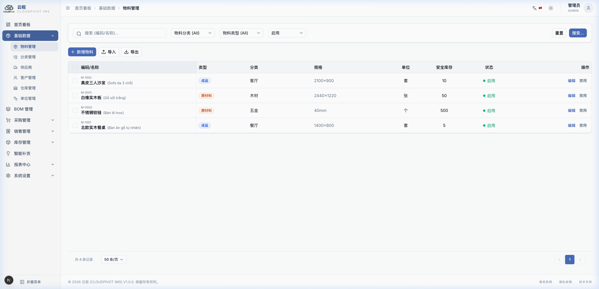

### 1.1 列表页怎么用？

*   **找料和找产品（筛选区）**：
    *   **搜名字**：在最左边的“输入搜索内容”框里，打入你想找的材料名字（比如“白橡”）或者编码（如“M-0001”），按下回车键（Enter）或者点右边的「查询」按钮，底下就只会显示这个材料。
    *   **按分类找**：点一下“分类”下拉框，可以只看“木材”或只看“五金”，点一下就能筛选。
    *   **按状态找**：有些料我们以后不用了，可以在状态里选“启用”或“禁用”。默认只会显示正在用的“启用”货品。
*   **顶部的三个大按钮**：
    *   **「+ 新增」**：要添加新材料时点它，会弹出一个很大的表格让你填。
    *   **「📥 导入」**：如果你手上有上百种材料要录入，用键盘敲会累死。点它下载我们的 Excel 模板，在表格里填好后，直接传上来，电脑几秒钟就帮你录好了。
        *   *注意*：上传后，电脑会先让你预览。如果里面有格式填错的或者单号重复的，行会变成**红色**，底下会写明原因，你需要改好重新传。
    *   **「📤 导出」**：点一下，系统会把你勾选或者当前查到的所有材料，做成一个 Excel 表格下载到你电脑里。
*   **表格底下的操作**：
    *   **「编辑」**：点一下可以修改这个材料的名字、规格等。
    *   **「禁用」**：如果这个料厂里以后再也不买了，可以点禁用。
        *   *安全铁律*：如果这个仓库里**还有这个料的库存**（只要不是0），或者有采购单、销售单里正用着它，电脑会**死活不让你禁用**，并报错提示你。必须先去仓库把货清空，或者把单子结了才行。

### 1.2 新建材料表单怎么填？（大白话说明）

点击「+ 新增」后会弹出一个大表单，别慌，我们分区域看：

#### ① 基本信息
*   **物料编码**：这是每个材料的唯一身份证号（如 `M-0001`）。新录入时，系统会自动帮你排下一个号，你不用动它。
*   **物料名称 (必填)**：输入材料的中文名字，比如：`北欧实木餐桌`。
*   **越南文名称**：**强烈建议填上**！比如输入 `Bàn ăn gỗ tự nhiên`。这样仓库的越南工人打印出库单、送货单时，能看懂，不容易拿错货。
*   **物料类型 (必填)**：[原材料]（买进来的）、[半成品]（做了一半的）、[成品]（能直接卖的）。选好后，以后开单子电脑会自动帮你选对应仓库。
*   **所属分类 (必填)**：点下拉框，选它属于哪一类。
*   **规格型号**：输入尺寸或规格，比如：`2440×1220×18mm`。
*   **计量单位 (必填)**：它是按什么算的？比如木材选“张”或“立方米”，螺丝选“个”，桌子选“套”。

#### ② 库存设置
*   **安全库存**：低于这个数，电脑就会在首页标红报警，提醒你该去买货了。
*   **最高库存**：仓库最大能堆多少，防止买太多压资金。

#### ③ 计量与追踪
*   **辅助单位与换算比例**：
    *   *比如*：你买螺丝是按“箱”买，但厂里用是按“个”领。你可以选辅助单位是“箱”，基本单位是“个”，换算比例写 `1 箱 = 500 个`。以后入库记 1 箱，仓库账上会自动变成 500 个。
*   **批次追踪模式**：
    *   `不追踪`：不分批次，只管总数。
    *   `强制追踪`：每次进货入库，**必须填一个批次号**（比如按日期记 `2026071501`）。出库时也必须选你拿的是哪个批次的货，方便以后质量出问题了找原因。

#### ④ 家具属性、包装与装柜
*   主要是出口产品用的。你可以录入这个家具是啥材质（如白橡木）、表面做啥漆（如油漆件），以及包装纸箱长宽高、一箱装几件、集装箱最大装多少等。不出口的话，这部分空着不填也行。

---

## 2. 分类管理 (材料分类树)

在这里把材料分成大类小类，方便整理。

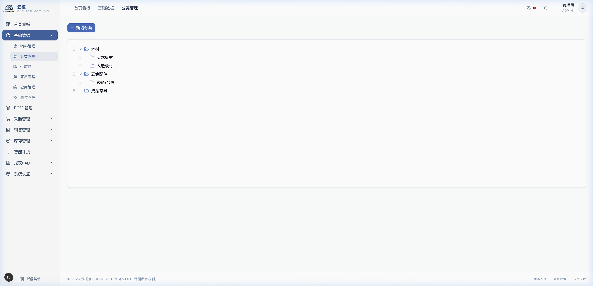

### 2.1 怎么操作？

*   **看分类**：点左侧的分类名，右侧就会显示这个分类的详细介绍以及里面都有哪些材料。
*   **加个新分类**：鼠标移到已有分类上，会出现一个「+」号，点它就能在它底下新建一个子分类（比如在“木材”下新建“白橡木板材”）。
*   **用鼠标拖拽调整位置**：如果你想把某个分类换个地方，可以用鼠标左键长按住这个分类，直接往别的地方拖动，松开鼠标就移过去了。
    *   *限制*：买进来的料不能拖到成品家具下面去，不能乱套。
*   **删除分类**：选中分类点「删除」。
    *   *限制*：如果这个分类底下已经登记了材料，或者它下面还有小分类，电脑会**拦截不让删**。必须先把分类下的材料移走才能删。

---

## 3. 供应商管理 (供应商登记)

登记平时给我们送货的那些公司和老板。

*   **结算币种**：一定要选对。比如中国供应商选“CNY 人民币”，越南当地选“VND 越南盾”。以后新建采购单时，电脑会自动切换成这个币种记账。
*   **首选供应商与报价**：
    *   在供应商详情里的“供应物料”Tab，点「+ 添加报价」，把这个供应商卖我们的材料和价格录进去（比如 A 供应商提供白橡板是 300 元/张）。
    *   如果有两家供应商都卖这个板子，你可以给平时最便宜、质量最好的一家勾选“首选”。以后系统提示缺料、让你一键补货时，**电脑会自动优先选这家供应商和价格开单子**，非常省事！

---

## 4. 客户管理 (客户登记)

登记跟我们买家具的经销商或散客。

*   **默认折扣率**：如果这个客户是老主顾，你可以给他设个默认折扣（比如写 `5` 代表 95 折）。以后给他开销售单，明细价格会自动打折。
*   **信用额度**：这个客户最大允许欠我们多少货款（比如 100,000 USD）。
    *   *作用*：如果这个客户欠款超了，你在给他审核销售单准备发货时，**电脑会弹出黄色警告框拦截**：“该客户欠款超限，是否继续发货？”。主管确认可以发才能继续。

---

## 5. 仓库管理 (仓库定义)

厂里的实体仓库。比如：原材料仓、成品 1 号仓、成品 2 号仓。
*   仓库类型分“原材料仓”、“成品仓”等。在系统设置里关联好后，开单时系统会根据货品类型自动选择默认仓，不需要手动选。

---

## 6. 单位管理 (计量单位)

预设好的“张”、“个”、“套”等。
每一个单位都写了中文、英文、越南文。厂里切换语言时，单位名字会自动跟着变。
�的库存。
*   **批次追踪模式**：
    *   单选按钮组：
        1.  `不追踪 (none)`：入库和出库无需录入批次，库存仅记录总量。
        2.  `可选追踪 (optional)`：入库和出库时允许用户录入或分配批次，若留空系统会自动生成默认批次归档。
        3.  `强制追踪 (required)`：入库时**必须**输入或生成批次号；出库和预留时**必须**指定具体批次，否则单据无法确认过账。

#### ④ 家具属性 (Furniture Properties)
家具制造行业的专属属性：
*   **材质**：如“白橡木”、“水曲柳”、“胡桃木”。
*   **颜色**：如“原木色”、“哑光黑”。
*   **表面工艺**：如“油漆件”、“免漆拉丝”。
*   **外形尺寸（长/宽/高）**：输入物料的物理长宽高尺寸（单位：mm）。

#### ⑤ 包装与装柜 (Packing & Shipping)
针对成品出口及长途运输包装的字段：
*   **客户品号**：客户方对该成品的对应编码。
*   **包装方式**：如“纸箱 K/D 拆装”、“整体气泡袋”。
*   **装箱数/柜容量**：一个标准集装箱（如 40HQ）最大可装载的该成品件数。
*   **包装尺寸（长/宽/高）**：包装后的纸箱尺寸（单位：mm）。
*   **净重 (kg) 与毛重 (kg)**：物料包装前后的重量。

#### ⑥ 其他信息 (Others)
*   **条形码 (Barcode)**：可手动录入或使用扫码枪直接扫入产品条码。
*   **备注**：录入补充说明。

---

## 2. 分类管理 (Categories)

系统分类管理支持树状的分层架构。


### 2.1 页面交互说明

*   **树形导航面板 (左侧)**：
    *   以层级折叠树展示当前的分类。顶级分类节点（原材料、半成品、成品）由系统固定，不可编辑和删除。
    *   点击分类节点左侧的三角图标（▶）展开下级子分类。
    *   点击具体分类节点，右侧面板会自动载入该分类的详细属性及该分类下的物料清单。
*   **新增子分类**：
    *   鼠标悬停在某个分类节点上，行末会浮现「+ 新增子分类」图标。
    *   点击会弹出轻量表单，需录入：分类编码（全局唯一）、分类中文名称、分类越南文名称。
*   **编辑分类**：
    *   选中节点后，在右侧详情卡片点击「编辑」按钮，修改分类名称或编码。
*   **拖拽调整层级 (Drag & Drop)**：
    *   系统支持鼠标直接长按拖动分类节点来改变其在分类树中的位置和层级。
    *   **限制规则**：子分类只允许在其所属的顶级节点（如“原材料”分类下的节点只能在“原材料”树内移动，不能拖拽到“成品”分类下）。
*   **删除分类**：
    *   点击分类卡片下方的「删除」按钮。
    *   **校验规则**：如果该分类下仍有子分类，或者当前分类已被任何一个物料档案所绑定，系统会拦截删除动作并红字报错。

---

## 3. 供应商管理 (Suppliers)

供应商档案主要用于采购模块，支持维护联系方式、财务结算属性以及供应商的专属物料报价清单。

### 3.1 供应商主档案维护
*   **国家/地区划分**：在新增供应商时，必须选择国家（越南 VN、中国 CN、马来西亚 MY、印尼 ID 等）。系统会自动在采购统计报表中按国家维度对采购额进行归类分析。
*   **结算币种**：指定该供应商默认的结算币种（如 VND 越南盾、CNY 人民币、USD 美元）。后续为此供应商创建采购单时，单据币种会自动变更为此默认币种。
*   **付款方式与账期**：可选“现结 (cash)”、“月结 (monthly)”、“季结 (quarterly)”，并可设置账期天数（如 30 天）。系统以此天数在财务应付款模块中自动计算该笔采购款的“逾期未付红字报警时点”。

### 3.2 供应物料报价维护
在供应商详情页的 **「供应物料 (Supplier Materials)」** 选项卡下：
*   **添加供应关联**：点击「+ 添加报价」按钮，选择系统中的原材料，并填入：该供应商的供应型号（代码）、交货周期（天数）、该供应商提供该物料的**外币单价**。
*   **首选供应商标记**：对于同一种原材料，可能存在多个供应商提供。可在其中一个供应商的报价行中勾选「首选供应商 (Primary)」复选框。
    *   **业务逻辑**：在进行“智能补货建议”并一键生成采购单时，系统会**自动提取标记为首选的供应商及其最新报价**生成草稿单。

---

## 4. 客户管理 (Customers)

客户档案主要用于销售与定制单模块。

### 4.1 核心功能点与控制说明
*   **客户类型**：划分为“经销商 (distributor)”、“零售客户 (retail)”、“工程项目 (project)”、“出口客户 (export)”。
*   **结算币种**：与供应商对称，决定该客户销售单的默认开票币种。
*   **默认折扣率 (%)**：可为客户设置固定的基础折扣（如 `5%` 填写 `5`）。为该客户创建销售单时，行折扣率会自动预填为此值。
*   **信用额度管理**：
    *   设置该客户允许的最大赊账欠款金额（折算为 USD/本币）。
    *   **业务校验**：在销售单“审核（approve）”以及销售出库“确认（confirm）”时，系统会自动计算：`该客户当前所有未结应收总额 + 本次单据待确认应收额`。如果计算出的金额**超出信用额度**，系统会弹出黄色警告框拦截/提醒。

---

## 5. 仓库管理 (Warehouses)

管理工厂的实体仓库，承载库存实物。

### 5.1 仓库定义字段
*   **仓库编码**：如 `W-001`
*   **仓库名称**：如 `成品1号仓`
*   **仓库类型**：划分为“原材料仓”、“半成品仓”、“成品仓”、“退货仓”。
*   **状态**：启用/禁用。

---

## 6. 单位管理 (Units)

管理全系统的计量单位。

### 6.1 单位多语言字段
为了适应中越联合建厂环境，每一个单位节点均包含三语名称：
*   **中文名**：如“张”
*   **英文名**：如“Sheet”
*   **越南文名**：如“Tấm”
系统会根据用户当前的系统语言，在物料详情、出入库列表、单据打印件中自动渲染对应的单位文本。

<!-- END OF 05-base-data.md -->


<div style="page-break-before: always;"></div>

<!-- START OF 06-bom.md -->
# 六、BOM 管理 (产品配料表)

BOM 就是我们家具工厂里的**“产品配料表”**。比如做一把实木椅子，需要 0.05 立方米橡木板、4 个角码、16 个螺丝。在系统里录入好这个配料表，以后开生产单和买料时，电脑就能帮你自动算账了。

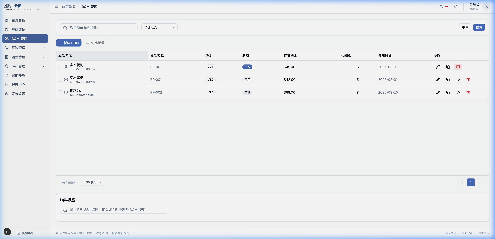

---

## 1. 配料表列表与版本控制

进入 **BOM 管理**，能看到我们厂所有成品的配料表清单。

### 1.1 版本控制（为什么一个产品有多个版本？）

随着工厂工艺改进，配料表可能会变（比如以前用普通木胶，现在改用环保木胶）。
*   **版本号**：你可以为同一个产品开多个版本的配料表，版本号写 `V1.0`、`V2.0` 等。
*   **「生效」按钮（只准一个版本管用）**：
    *   在配料表详情里，如果点击了**「生效」**按钮，这个版本就会变成主版本。
    *   **唯一生效原则**：一旦这个版本生效，**电脑会自动把该产品以前所有的旧版本都停用（标记为已失效）**。以后生产领料、算成本，电脑都只会认这一个生效的配料表。
*   **「复制」按钮（省去重复录入）**：
    *   如果你要在老配料表的基础上只改一颗螺丝，不用重新录入上百行。点一下「复制」，电脑会帮你一模一样复制出一张“草稿”状态的表，你在上面微调就行了。

---

## 2. 新建和编辑配料表

点右上角的**「+ 新建 BOM」**，进入编辑页面：

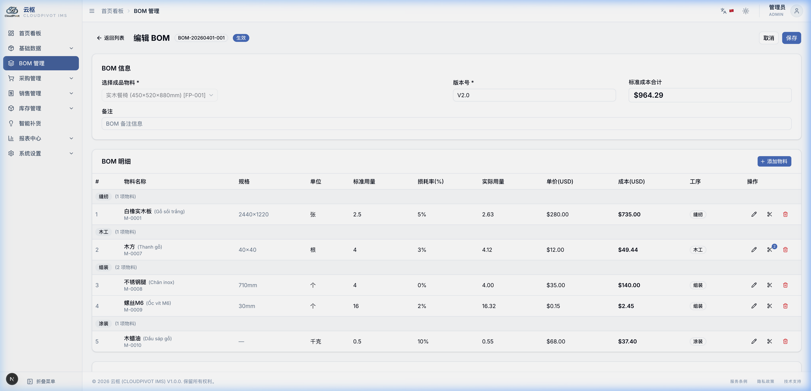

### 2.1 里面填写的字段是什么意思？

*   **成品选择器**：点一下，选你要给哪个家具做配料表。只允许选类型为 `成品` 或 `半成品` 的货品，不能选原材料（你不能给螺丝配个配料表）。
*   **版本号**：必填。比如打入 `V1.0`。
*   **标准成本（只读）**：
    *   系统会根据你底下录入的每种材料用量和价格，**自动算出这件家具的理論材料成本是多少钱**。
*   **子件表格（加料）**：
    *   点表格下面的「+ 添加子件」行，选需要的材料，然后填入：
        1.  **标准用量**：生产**一件**家具，纯净要用掉多少（比如：餐椅用木料 `0.05` 立方米）。
        2.  **损耗率 (%)**：木头锯掉的木屑、多出的边角料。打入 `5` 代表 5% 的损耗。领料时电脑会自动帮你加上这部分损耗。
        3.  **分配工序**：选这个料在哪个车间用（比如：板材选“开料”车间，拉手选“组装”车间，油漆选“涂装”车间）。

---

## 3. 用料计算器与物料反查 (两个好用的工具)

在页面右上角，有两个专门为采购和生产主管准备的省心工具：

### 3.1 用料展算 (用料计算器)
*   **啥时候用**：比如下个月厂里要生产“100 张餐桌”和“400 把餐椅”，你想知道库房里的料够不够，要买多少料。
*   **怎么操作**：
    1.  点右上角**「需求展算 (BOM Calculator)」**。
    2.  点「+ 新增成品行」，选餐桌打入 `100`，再选餐椅打入 `400`。
    3.  点**「开始展算」**按钮。
    4.  电脑会像长了眼睛一样，去翻出这两个产品正在生效的配料表，把螺丝、木板、胶水总量乘一下累加起来，几秒钟就吐出一张清单：告诉你**一共需要多少料、仓库里现在还剩多少、你的缺口是多少**。
    5.  你可以直接点「导出 Excel」把缺料清单发给采购去订货。

### 3.2 物料反查 (找谁用了这个料)
*   **啥时候用**：比如厂里某种特定的金扣件突然断货了，你想立刻查查**到底有哪几种家具配方里用了这个金扣件**，好安排车间避开这些产品去生产。
*   **怎么操作**：
    1.  点**「物料反查 (Where Used)」**标签。
    2.  选你想查的那个金扣件。
    3.  表格里会立刻列出所有在配方里用了它的家具成品和用量，一目了然！

<!-- END OF 06-bom.md -->


<div style="page-break-before: always;"></div>

<!-- START OF 07-purchase.md -->
# 七、采购管理

采购管理就是记录我们向供应商“买材料”的过程。包括三步：**下采购单（签合同订货） -> 货到了办入库（货进库房，账记应付） -> 发现不合格退货（退给供应商）**。

---

## 1. 采购单 (下采购订单)

采购单是我们发给供应商的订货清单。

### 1.1 怎么找以前的单子？

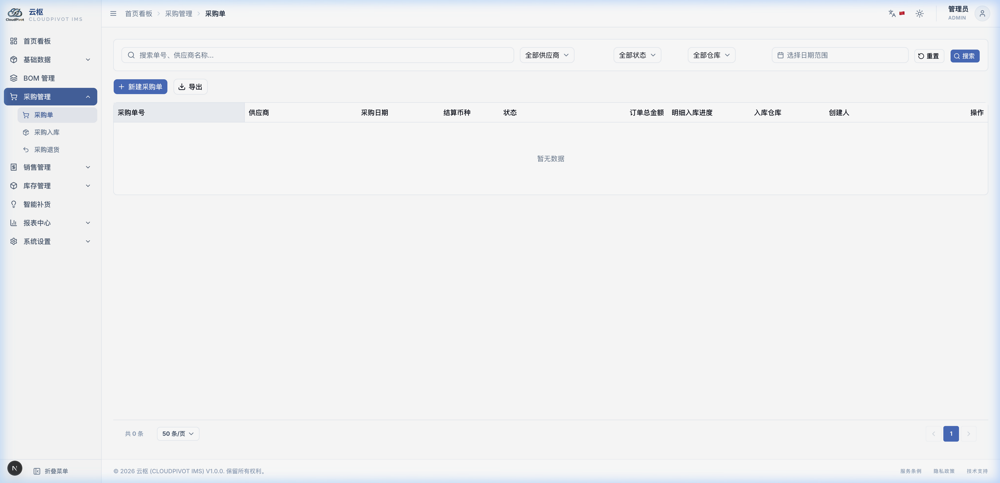

*   **采购单列表**：
    *   在顶部筛选框里，你可以打入单号（比如 `PO-20260715-001`）或者选供应商的名字，来找以前下的单子。
    *   可以通过状态来过滤，比如选“草稿”只看还没订好发出的单子，选“已入库”看已经收完货的单子。

### 1.2 怎么开一张采购单？

点击右上角的**「+ 新建采购单」**，弹出录入页面：

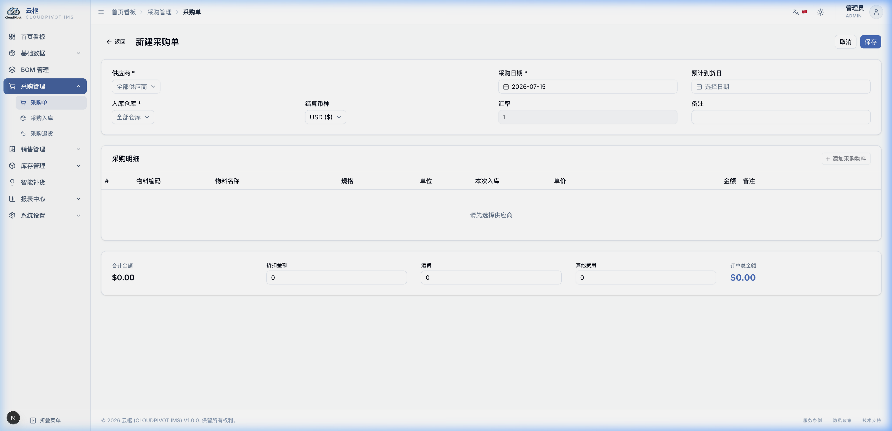

#### ① 选好供应商和入库仓库
*   **供应商**：必须选。选好后，系统会自动帮你把这笔订单的币种换成该供应商默认的币种（比如选中国供应商，自动变人民币 CNY，结算汇率也会自动帮你算好）。
*   **入库仓库**：选这批货默认送往哪个库房，通常选“原材料仓”。

#### ② 录入买什么料（明细编辑）
*   点**「+ 添加物料」**按钮，选你想买的原材料。
*   如果这个供应商之前登记过报价，你可以点**「从供应商报价导入」**，勾选后直接带进来，单价会自动填好，不用你看着纸质报价单用键盘打字。
*   **输入采购数量**：电脑会自动算出这一行的金额（数量 × 单价）。

#### ③ 折扣与附加费用录入
在明细表下方，如果发生折减或者额外费用，可以在这里输入：
*   **整单折扣金额**：供应商给我们便宜了多少钱（原币）。直接输正数，比如便宜了 50 元就输 `50`。
*   **运费**与**其他费用**：运输费、报关费等（原币）。
*   **电脑自动算总价**：
    *   应付总价 = 买料总金额 - 折扣 + 运费 + 其他费用。
    *   系统底下还会贴心地换算成美元（USD）显示，方便老板看财务账。

---

## 2. 采购入库 (送货到了，点收进仓)

供应商把货送到了，我们要点数并记到账上。

### 2.1 怎么把货收进仓库？

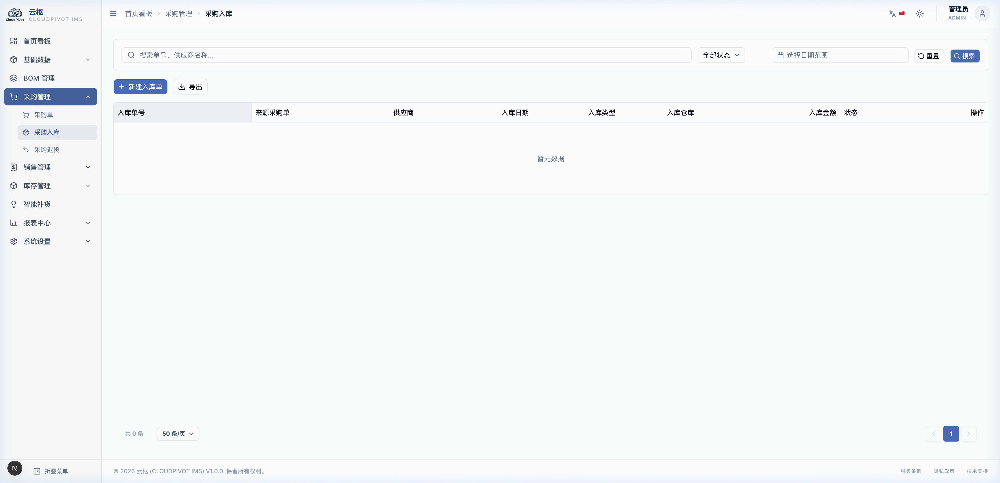

1.  进入 **采购入库单** 列表，点右上角蓝色按钮**「+ 关联采购单入库」**。
2.  在弹窗里，找到那张已经审核通过的采购单，双击选中它。
3.  系统会自动把单子里订的所有材料、数量、价格都带出来，你不需要自己打字。
4.  **填实际收货数量**：数一下供应商送来了多少，把数量填进“本次入库数量”框里。

### 2.2 收货时有几个必须知道的硬规则（新手重点看）

*   **货送多了怎么办？(110% 限制拦截)**：
    *   *比如*：你采购单上定了 100 张木板。供应商送货来时，如果送了 105 张，系统是允许入库的（合理送货溢量）。但如果供应商一下送了 120 张，系统检测到你输入的本次入库数量**超过了剩余未入库数量的 110% (即超过 110 张)**，点击保存时**系统会硬性弹框拦截，不让你保存**！
    *   *怎么办*：多送的货让供应商拉回去，或者让采购部去修改原始采购单的定货量，重新审核后再办入库。
*   **必须要写批次号的料**：
    *   如果某种材料（比如油漆）设为了强制批次追踪，在入库时，你**必须填上批次号**（比如你可以填今天的日期 `20260715` 加上送货车牌号）。不填的话，电脑会警告并不让你点收。
*   **运费和折扣在分批收货时怎么算？(分摊和抹平尾差)**：
    *   *例子*：一张采购单分了三次送来。采购单上有 100 元运费和 50 元折扣。
    *   *系统计算*：前两次入库时，系统会**自动按送货货款的比例**，把运费和折扣分摊到入库单上（比如第一批送了一半，就分摊 50 元运费和 25 元折扣）。
    *   *最后一次抹平*：因为除法会有除不尽的小数点尾差，最后一次送货入库时，系统会自动采用**“倒挤法”**，直接用总费用减去前两次已经扣掉的，把最后一分钱抹平，财务做账的时候一分钱的差错都不会有，你不需要自己拿着计算器去算每次分摊多少！

---

## 3. 采购退货 (品质不行，退给供应商)

如果发现货品有瑕疵要退货：

1.  进入 **采购退货单**，点击「+ 新建退货单」。
2.  **必须选择是退哪一次的入库单**：在单头下拉框里选中对应的入库单号，系统把那次收进仓库的货带出来。
3.  输入你要退货的数量。**退货数量不能超过那批货现在还在仓库里的剩余数量**。
4.  确认后，仓库里的库存数量会自动扣掉，系统还会重新帮你算材料的新成本。同时，财务账上会自动生成一笔**负金额的调整账**，把我们欠供应商的货款减掉，不用担心多付钱！

<!-- END OF 07-purchase.md -->


<div style="page-break-before: always;"></div>

<!-- START OF 08-sales.md -->
# 八、销售管理

销售管理就是记录我们向客户“卖产品”的过程。包含三步：**开销售单（订货合同） -> 仓库发货（办销售出库） -> 客户不满意退货（办理销售退货）**。

---

## 1. 销售单 (接客户订单)

销售单用来登记我们要卖什么产品给客户。

### 1.1 怎么开一张销售单？


1.  进入 **销售单** 列表，点右上角蓝色按钮**「+ 新建销售单」**。


2.  **选好客户**：
    *   在最上面选客户。系统会自动帮你把单子的币种换成跟客户结账的币种（如人民币或越南盾），并自动把他的收货地址带出来。
    *   如果我们在客户档案里给他设了“默认打 95 折 (折扣率写 5%)”，这里明细里的货品价格会自动打折，不用你手动去改价格。
3.  **选货品并输数量、算折扣**：
    *   在货品行选你要卖的家具，输入数量和单价。
    *   **行折扣**：如果单行要便宜，比如这一行便宜 10%，就打入 `10`。
    *   **整单折扣**：如果整张单子最后还要再折减，在最底下的“整单折扣”里填入比例即可。
    *   **总价自动计算**：
        *   应收总价 = 所有货品打完折的总额 - 整单折扣 + 运费 + 其他费用。

### 1.2 审核单子时的两道“硬防线”（新手必读）

当你点**「审核 (Approve)」**按钮发单时，电脑会在后台进行两个严格的自动检查：
*   **第一道防线：零库存不准卖！(零库存拦截)**：
    *   系统会自动去查这个库房里你要卖的这个家具还有没有货（可用库存）。
    *   如果仓库里这个家具的可用库存是 **0**，电脑会**坚决拦截，弹红色警告框**：“库存为零，无法审核发货”。你必须先让工厂生产或者进货。
*   **第二道防线：客户欠款超限报警！(信用额度预警)**：
    *   如果客户之前买货一直没付钱（欠款额很大），电脑会自动算出：“该客户当前的欠款总额 + 这张单子的总金额”。
    *   如果算出来的数**超过了该客户在户口本里设的信用额度**，电脑会弹出**黄色警告框**：“客户信用额度超限，当前欠款已达 XXX 元，是否强制发货？”。此时，必须点击确认强行通过，或者先去催客户付账。

---

## 2. 销售出库 (把货发出，记应收款)

审核通过后，仓库管理员需要办出库手续，把实物扣减掉。

### 2.1 怎么操作出库？


1.  进入 **销售出库单**，点击**「+ 关联销售单出库」**。
2.  双击选中那张已审核的销售单。系统会把货品清单带出来。
3.  **批次怎么分配？(先进先出规则)**：
    *   如果卖出的家具在进库时记了批次号，系统会非常聪明地按照**“谁先入库就先发谁 (FIFO 先进先出)”**的规律，自动帮你挑出最早进仓的批次数量。
    *   *你要换批次怎么办*：如果你去货位上拿货时，发现最早的那批被压在底下，拿不出来，你想拿最新入库的那批。你可以在出库单明细里的“批次”下拉框双击，**用鼠标手动选择你实际拿出来的那个批次**。你手动改了之后，系统会尊重你的决定，按你选的扣减库存。
4.  点确认出库，仓库物理库存扣减，财务账上自动记上一笔客户欠我们钱的“应收账款”。

### 2.2 出库时成本是怎么记的？(双轨成本固化)

为了方便老板查账算利润，发货的一瞬间，电脑会把这两个成本数字存进这张单子里：
1.  **标准成本**：就是这个家具按工艺配方（BOM表）算出来的理论材料成本。
2.  **实际成本**：就是用这个仓库里当前所有这批货的移动平均进价成本算的实际价格。
两个数据同时保留，以后查利润报表时，可以随便切换着看！

---

## 3. 销售退货 (客户把货退回来了)

如果客户退货回来：

1.  退货必须**关联原来的销售出库单**，不能平空退货。
2.  退回的货，必须退回到它原来发货时记录的那个批次中去。
3.  **成本怎么算？(原单快照继承)**：
    *   退货回仓库时，增加的库存单价**绝不采用仓库当前可能已经被其他货品稀释过的移动平均成本**，而是**死死锁死并继承这批货发出去时记录的成本**，避免退货搞乱我们仓库里原有的材料成本单价。
    *   退货后，财务账上会自动生成一笔**负数调整账**，把客户欠我们的钱扣减掉，账目一清二楚！

<!-- END OF 08-sales.md -->


<div style="page-break-before: always;"></div>

<!-- START OF 09-inventory.md -->
# 九、库存管理

库存管理就是记录我们库房里“货的进出和盘点”。包括：**查库存（看看还剩多少货） -> 记自由出入库（借料、样品、报废） -> 查流水（谁在什么时候拿了什么货） -> 盘点（数一下实际的货对不对得上账）**。

---

## 1. 库存查询 (查库房里还有多少货)

库存查询是让我们随时用电脑看货品数量的窗口，大热天再也不用亲自跑去库房里数数了。

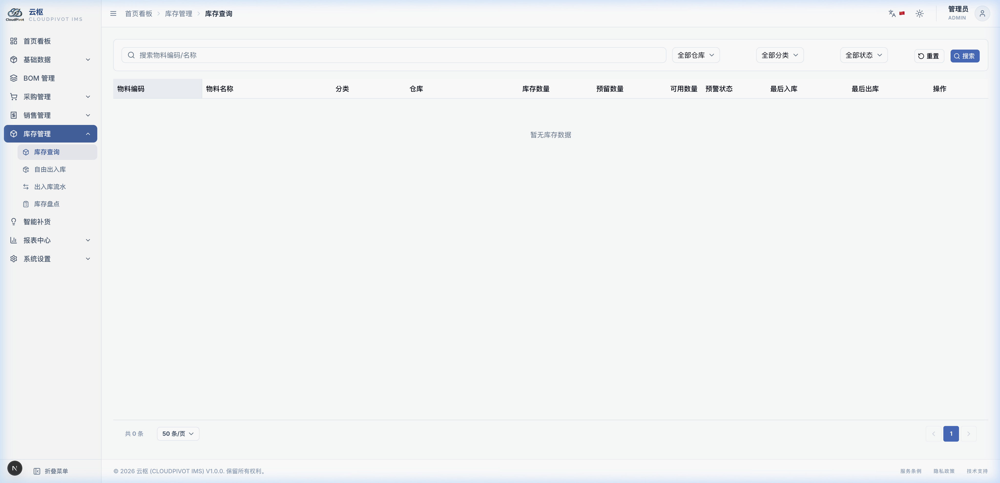

### 1.1 界面上的数据怎么看？

*   **三个关键的数量指标（非常重要，请分清）：**
    1.  **当前库存（在库数）**：仓库里实实在在堆着的物理数量。
    2.  **预留库存（锁定的货）**：已经被订货客户预定、或者工单要用，但还没发货拉走的数量。
    3.  **可用库存（可以动用的数）**：
        *   公式：`可用库存 = 当前库存 - 预留库存`。
        *   **注意**：我们平时卖货、开采购补货，**都是看可用库存**！因为被锁定的预留库存即使堆在库房里，也是别人的，你不能再卖给别人！
*   **红黄高亮报警规则**：
    *   如果某种材料的“可用库存”**低于安全库存**，这行的数量会变成**红字粗体**，行首还会打上 ⚠️ 警告图标，代表快断货了，催你快去买！
    *   如果数量**高于最高库存**，数量会变成**黄底黑字**，提示积压，别再买啦！

---

## 2. 自由出入库 (非买卖的料进出登记)

用于非买卖、非生产的临时货品变动。比如：同事管仓库“借用”了木板、给客户发“样品”、材料放久了“报废”等。

### 2.1 怎么开自由出入库单？

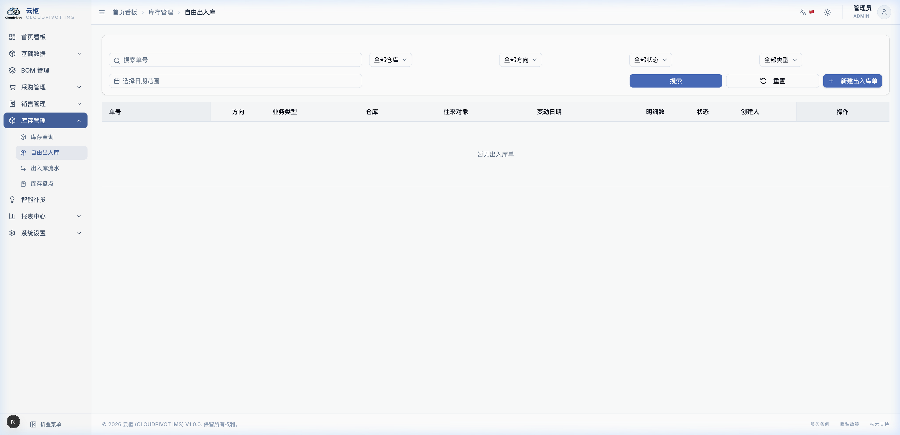

1.  进入 **自由出入库**，点击**「+ 新建自由移动单」**。
2.  **选方向与业务类型**：
    *   先选是 `入库 (In)` 还是 `出库 (Out)`。一张单子里只能选一个方向。
    *   **业务类型（大白话说明）**：根据不同情况选。比如借货选“借入入库”或“借入归还出库”（此时往来对象必须选填借货人名字）；如果是木板烂了扔掉，选“报废出库”（此时备注框里必须用键盘写明原因）。
3.  **批量加材料（最多 100 行）**：
    *   点「添加行」选择物料。如果你打字输入了两个相同的货品，前台会自动合并，不用担心重复。
4.  点**「保存草稿」**。单子会保存下来，不影响库存，你可以随时进去修改里面的数量。

### 2.2 两个防止出错的“硬控制”

*   **大额大数警告 (风控二确)**：
    *   如果你单子里填写的入库总金额**超过了 10,000 USD**，或者货品数量**超过了 1000 个**，在你点“确认过账”时，系统会跳出一个很大的红色警告框。必须再次点确认才能通过，防止粗心多打了一个 0 搞错账。
*   **只要有一行料不够，整张单子都退回 (原子过账与缺口提示)**：
    *   *例子*：你开了个出库单，要领 A 木板 10 张，B 螺丝 20 个。但仓库里 A 木板只有 9 张（缺 1 张）。
    *   *拦截*：点击过账时，**电脑会强制把整张单子拦截退回**，绝对不会出现“螺丝扣了，木板没扣”的乱账。电脑会弹出一个清清楚楚的缺料表格，红字告诉你：`A木板缺口 1 张`，你必须把数量改对才能过账。

---

## 3. 出入库流水 (查账目历史)

流水记录了工厂发生的每一次库存数量变化，是谁点收的、什么时候出的、关联哪张采购销售单。

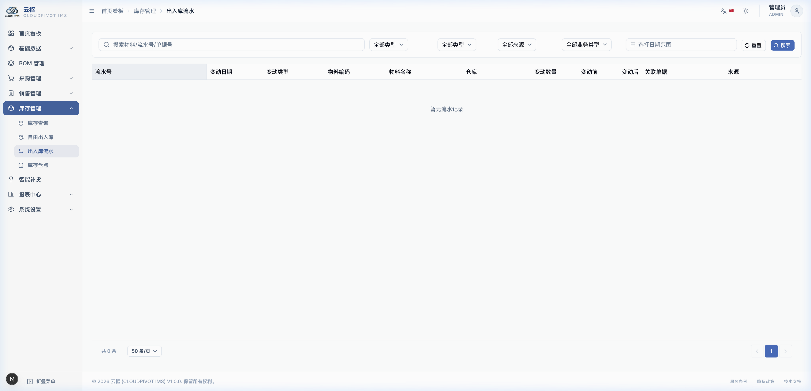

*   **查明细**：入库显示为**绿色正数（如 +50）**，出库显示为**红色负数（如 -20）**。
*   **找疑点**：可以过滤“手工自由出入库”，专门查那些非买卖的报废、借用单，防止有人私自带材料出厂。

---

## 4. 库存盘点 (数数校对账目)

每隔一段时间（比如月底），我们需要去库房数一数实际的货，和电脑账本上的对一下。

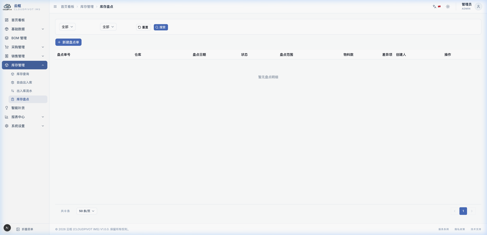

### 4.1 盘点三步走（极简录入设计）

*   **第一步：做快照锁定**：
    *   点「+ 新建盘点单」，选你要盘的仓库。点生成后，系统会自动**锁定快照（把这一瞬间电脑上的账面库存冻结存下来）**，生成一张盘点单。
*   **第二步：数货并输入实盘数**：
    *   把盘点单打印成纸带去仓库数数。
    *   **极简录入**：电脑上实盘数默认预填了跟账面一样的数字。你数货时，如果螺丝账面 100 个，实际数出来也是 100 个，**你不用动它，空着不管**！如果木板账面 50 张，实际数出来是 48 张（亏了 2 张），你**只需要双击修改这一行**，把实盘改成 `48`。只有改过的行才会参与计算，省去你重复打字的麻烦！
*   **第三步：确认过账**：
    *   录完差异点，检查无误，点「确认过账」。电脑会自动生成“盘盈入库”或“盘亏出库”，自动把仓库的库存改成你刚刚数出来的实物数。

### 4.2 盘点时的防捣乱警告

*   当某个仓库正在进行盘点（盘点单还没确认完结）时，如果有别的同事试图往这个仓库办采购入库或发货：
    *   系统在他们保存单子时会跳出**黄色警告框**：“该仓库正在盘点，此时办理进出货可能会导致盘点数对不上！”。这能有效防止别人乱开单搞乱我们的盘点数据。

<!-- END OF 09-inventory.md -->


<div style="page-break-before: always;"></div>

<!-- START OF 10-custom-and-production.md -->
# 十、定制单与生产工单

> [!IMPORTANT]
> **功能状态说明**：
> 「定制单管理」与「生产工单」模块在系统当前阶段中**处于待定/暂未开放状态**。
> 本章节内容作为未来版本的操作指引，供业务流程设计参考。系统侧边栏中默认隐藏了该入口，待测试通过后将逐步开放。

家具制造行业多为非标定制生产。本系统提供从非标定制单的参数设计、报价核算、原料预留，到下达生产工单进行领料、完工入库的全闭环管理。

---

## 1. 定制单管理 (Custom Orders)

用于记录客户的个性化尺寸、材质、工艺定制需求，并测算报价。

### 1.1 定制配置项与加价机制

1.  进入 **定制单管理**，点击**「+ 新建定制单」**。
2.  **基本信息录入**：选择客户、交货日期、定制类型（尺寸定制、材质定制、全定制）和关联的“参考标准产品”（如基于标准品 `北欧餐桌 M-1001` 进行加宽定制）。
3.  **定制配置明细表**：
    *   点击「添加配置项」，逐行输入定制的具体变动参数：
        *   **配置项名称**：如“宽度”。
        *   **标准值**：如“1400mm”。
        *   **定制值**：如“1600mm”。
        *   **加价金额 (Markup)**：输入因该项改动需要向客户追加的费用金额（原币，如 500,000 VND）。系统会自动将所有配置项的加价额进行汇总，计入最终的报价参考中。

### 1.2 定制 BOM 展算与原材料预留占扣

*   **定制 BOM 自动生成与成本测算**：
    *   选定参考产品并保存后，系统会自动**完整复制**该参考产品当前已生效的标准 BOM，生成一份专属的“定制 BOM”。
    *   **人工用料调整**：用户可点击「调整用料」按钮，进入定制 BOM 修改页面，针对此次定制单独增加子件（如多用 0.2 张板材、换用更高级的五金件）。修改后，系统会自动重算**定制材料成本总额**。
*   **定制单确认与原材料预留占扣（FIFO 预占）**：
    *   当报价与客户谈妥后，管理员在详情页点击**「确认 (Confirm)」**按钮，定制单状态变更为 `已确认`。
    *   **预留占扣逻辑**：在确认的一瞬间，系统会自动为该定制单明细中的所有原材料计算需求量，并直接在库存中生成**“原材料库存预留记录”**：
        *   对启用了批次追踪的原材料，系统默认按 **FIFO（先进先出）** 策略，将仓库中最老批次的可用数量进行“预占（reserve）”锁定。
        *   锁定后的库存数量会累加到库存查询的“预留库存”中，使得“可用库存”下降，防止被其他日常自由出库或新采购单出库占走。若库存不足，缺口数量会自动生成并推送到“智能补货建议”中。

### 1.3 一键转销售单联动

*   定制单确认后，可在页面顶部点击**「转销售单 (Convert to SO)」**。
*   系统会自动生成一张关联的销售单，将客户、定制说明、最终报价金额、结算币种和汇率完整带入。
*   **不重复占扣成品库存规则**：
    *   转为销售单时，由于定制家具此时并未生产出来（实物为 0），系统仅建立业务单据的关联引用关系，**绝不立即占用或预留成品库存**。此时，该定制单占用的依然是最初的那套“原材料预留”，直至下达生产工单进行消耗。

---

## 2. 生产工单 (Production Orders)

生产工单负责承接定制单或标准排产计划，管理“领料出库”与“完工入库”。

### 2.1 工单状态转换流转

工单具有严密的生命周期状态，只能依次流转，不允许跨状态操作：

```
草稿 ──→ 领料中 ──→ 生产中 ──→ 已完工
  │                    │
  └───→ 已取消         └───→ 已取消（需退料）
```

*   **草稿 (Draft)**：
    *   刚创建或从定制单点击“下达生产”时生成的初始状态。此状态下可编辑修改计划产量、BOM 结构。无任何库存扣减。
*   **领料中 (Picking)**：
    *   当对工单生成了第一笔“领料出库单”时，工单自动转为此状态。系统开始冻结工单修改，只允许执行领料或退料操作。
*   **生产中 (In Progress)**：
    *   领料达到一定比例或手动点击「开始生产」后转为此状态，代表车间正式开工。
*   **已完工 (Completed)**：
    *   当累计完工入库的数量等于或大于计划生产数量，或者手动点击「完成工单」后，工单转为此终态，所有未领用预留自动释放回库房，工单归档不可再编辑。

### 2.2 领料出库、超领控制与退料入库

*   **承接定制预留领料**：
    *   若工单是由定制单生成的，点击「领料出库」时，系统会**优先消耗该定制单之前已经预占的原材料批次**，无需重新计算和抢占库存。
*   **超领控制 (120% 阀值拦截)**：
    *   为了控制车间物料损耗，系统设置了 `120%` 的累计领料上限。
    *   **拦截规则**：对工单明细中的任何一种原材料，其累计领出数量**不得超过（BOM标准需求量 × 120%）**。超出此数量时，系统会强制置灰确认按钮，必须由生产主管在系统设置中临时调整额度或追加审批方可超领。
*   **退料入库**：
    *   生产结束后，若有剩余未消耗的原材料，在工单页点击「退料入库」，录入退回的仓库和批次，确认后库存回增。如果该定制单和工单尚未完结，退回的原料会**优先恢复为该定制单的“原材料预留”**；若工单已完结，则释放为可用库存。

### 2.3 完工入库与成品分配

1.  生产完成，点击工单详情页的**「完工入库」**。
2.  输入实际完工数量，选择入库的“成品仓”，系统自动生成 `production_in` 流水。
3.  **完工成本计算**：
    *   系统会自动汇总该工单所有已领料出库的原材料实际成本总额，除以本次完工数量，自动算出成品的**实际入库单位成本**，并写入库存更新移动平均成本。
4.  **关联销售单成品分配预留**：
    *   若此工单源自某个定制单且已转为销售单，完工确认的一瞬间，系统会将入库的实物成品**自动且优先分配预留给该关联销售单**（成品预留标志改为 `sales_order`），销售出库时可直接出货，同时原定制单占用的那套“原材料预留”被彻底释放清除，完成物料链条交接。

<!-- END OF 10-custom-and-production.md -->


<div style="page-break-before: always;"></div>

<!-- START OF 11-replenishment.md -->
# 十一、智能补货 (买料建议)

这个模块就像是厂里的“补货大管家”。它能根据厂里平时每天消耗多少料、供应商送货要几天、以及仓库里现在还剩多少可用库存，自动帮你算出来：**哪些料快断货了、该找谁买、买多少最划算**。


---

## 1. 怎么看懂电脑给的采购建议？

进入 **智能补货** 页面，电脑会自动列出需要买货的材料明细。

### 1.1 列表里的核心数据代表啥？

*   **日均消耗量**：系统自动看过去 90 天里，车间每天平均要领用掉多少这个料（比如每天用掉 5 张白橡木板）。
*   **预计断货天数 (最直观的催命指标！)**：
    *   *怎么算*：`可用库存 ÷ 日均消耗量`。
    *   **颜色代表紧急程度**：
        *   **深红背景 + 「已断货」**：已经没料了！而且现在有未发货的订单正等着要这个料，必须立刻马上去买！
        *   **橙色背景 + 「极度紧急」**：料只够用 1 到 7 天了，再不买下周就要停工了！
*   **推荐供应商与参考进价**：自动带出你在供应商档案里勾选的那个“首选供应商”和最新的报价。
*   **建议采购量**：电脑自动帮你算好的最佳买货数量。

---

## 2. 它是怎么帮我们算“买多少”的？

在页面右上角点击**「策略配置」**按钮，你会看到几个设置框，我们可以用大白话来理解它们：

| 选项名称 | 默认值 | 意思是什么？（大白话打个比方） |
|:---|:---|:---|
| **补货周期 (天数)** | `7` 天 | **买货在路上走的时间**。从我们给供应商下单，到供应商把货送到厂里，平均要花几天。 |
| **安全天数** | `3` 天 | **备用天数**。怕供应商路上堵车延误、或者厂里突然来急单，多预留几天的干货存量。 |
| **批量倍数** | `1` | **整箱整包购买的对齐数**。比如某种螺丝一箱是 50 个，不拆散卖。把倍数设为 50，如果算出来需要 82 个，电脑会自动把建议量进位成 `100`（即 2 箱）。 |

### 2.1 电脑的计算公式（用买馒头打比方）：

你想买多少馒头，取决于：`（你每天吃几个 × (快递送几天 + 备用几天)） - 冰箱里还剩几个 + 冰箱里必须存着的底数`。

**建议采购量 = （日均消耗量 × (补货周期 + 安全天数)） - 可用库存 + 安全库存**

---

## 3. 一键生成采购单 (最省事的功能)

采购员不用自己对照着单子一个个输入货品和价格：

1.  在补货列表里，把你想买货的几行料前面的**小方框勾选上**（可以跨供应商多选）。
2.  点列表上面的蓝色大按钮：**「一键生成采购单」**。
3.  **电脑自动帮你分家 (自动拆单)！**：
    *   *例子*：你勾了 5 种料，其中 3 种是找 A 供应商买，2 种是找 B 供应商买。
    *   *结果*：点完后，**电脑会自动帮你开出 2 张采购单草稿**（一张写着 A 供应商，一张写着 B 供应商），里面已经把货品名、单价和数量都填好了。
4.  你可以点击弹出的采购单链接，进去做最后核对，点一下审核，订货就完成了！

<!-- END OF 11-replenishment.md -->


<div style="page-break-before: always;"></div>

<!-- START OF 12-finance.md -->
# 十二、财务管理

> [!IMPORTANT]
> **功能状态说明**：
> 「财务管理」（应收/应付账款）模块在系统当前阶段中**处于待定/暂未开放状态**。
> 本章节内容作为未来版本的操作指引，供业务流程设计参考。系统侧边栏中默认隐藏了该入口，待测试通过后将逐步开放。

本系统提供辅助的应收/应付账款核算，记录与供应商和客户的日常收付款明细，帮助财务人员完成账目核对与催收。

---

## 1. 应付账款 (Payables)

记录工厂因采购入库而产生的负债及付款进度。

### 1.1 应付账款列表与预警说明

*   **明细展示**：
    *   每一行代表一笔已确认的采购入库单。
    *   字段包括：应付单号、关联入库单号（PI-*）、供应商名称、应付金额（原币）、已付金额、未付余额、结算币种、汇率、付款截止日期（账期到期日）、单据状态。
*   **三种状态定义**：
    *   `未付款 (Unpaid)`：已付金额为 0。
    *   `部分付款 (Partially Paid)`：已付金额大于 0 且小于应付金额。
    *   `已付清 (Paid)`：已付金额等于应付金额。
*   **逾期红字报警规则**：
    *   如果应付单状态为“未付款”或“部分付款”，且当前系统日期**已经超过了“付款截止日期”**，则整行背景会呈现**淡红色**，截止日期单元格会呈现**红字粗体并闪烁**，提示已发生账期逾期。

### 1.2 付款登记表单操作

1.  在应付账款行尾点击**「登记付款 (Record Payment)」**。
2.  **表单录入**：
    *   **付款日期**：默认当天，可选择历史日期。
    *   **本次付款金额 (原币)**：录入实际支付给供应商的金额（原币）。系统限制其**不得大于“未付余额”**。
    *   **付款账户**：选择付款银行账号或现金账户。
    *   **交易凭证号**：输入银行回单号或支票号，以便后续对账。
3.  点击「确认保存」：
    *   系统会自动累加已付金额并扣减未付余额，重新判定单据状态。

---

## 2. 应收账款 (Receivables)

记录工厂因销售出库而产生的债权及收款进度。

### 2.1 应收账款列表页面

*   明细结构与应付账款对称。
*   支持按客户名称、账期是否逾期、单据状态进行多维过滤。
*   逾期应收同样会触发红字高亮预警，协助销售人员进行回款催收。

### 2.2 收款登记操作

1.  选中应收账款行，点击**「登记收款 (Record Receipt)」**。
2.  输入收款金额（不得超过未收余额）、收款日期及收款账户，上传银行到账水单号。
3.  保存后，客户未收余额自动扣减。若该客户设置了信用额度，随着未收余额的扣减，该客户在系统中的**信用可用额度会自动恢复**。

---

## 3. 退货财务冲减与轧差轧账 (Returns Offset)

当发生采购退货或销售退货时，为了不破坏已入账的历史财务流水，系统采用 **「退货冲减模型」**。

### 3.1 冲减抵扣业务规则

*   **生成 `return_offset` 调整单**：
    *   当一张采购退货单（或销售退货单）确认过账时，财务系统会**自动生成一笔负金额的财务调整单**（类型标记为 `return_offset`），该单据会自动与原始的入库应付单（或出库应收单）建立强关联关系。
*   **供应商/客户未收未付余额计算**：
    *   在计算某供应商的“未付总额”或进行“供应商对账”时，系统会自动进行轧差计算：
        $$\text{未付总余额} = \sum(\text{正常应付金额}) - \sum(\text{已付金额}) - \sum(\text{退货调整单绝对值金额})$$
    *   这保证了财务在打印对账单时，能够完整清晰地展现“原始进货 -> 期间付款 -> 退货冲抵 -> 最终应付差额”的对账链条，账目可追溯且清算无误。

<!-- END OF 12-finance.md -->


<div style="page-break-before: always;"></div>

<!-- START OF 13-reports.md -->
# 十三、报表中心 (查账与分析)

报表中心是老板和各部门主管看数据的地方。这里把所有的采购、销售、库存单据做成了可视化的图表（柱状图、圆饼图），能让你一眼看出哪里在赚钱、哪里在赔钱、什么货在积压。

---

## 1. 采购与销售分析 (看进货与利润)

主要用来分析厂子最近花出去多少钱，赚回来多少钱，哪个供应商送货最快。

### 1.1 销售毛利分析 (到底赚了多少钱？)

本报表支持**“计划利润”与“实际利润”**两种视角的切换，这在家具行业特别管用：

*   **口径切换小单选按钮**：
    *   `[○] 标准毛利视角`（计划利润）：按图纸配方（BOM）的理论材料价来算成本。
    *   `[●] 实际毛利视角`（实际利润）：按仓库里实际收货的加权平均进价来算成本。由于原材料价格经常变，**看实际毛利视角最接近真实的利润情况**。
*   **点击看明细（数据下钻）**：
    *   *怎么看*：在表格里点一下“椅子”分类，表格会自动展开显示椅子下面所有的具体型号；再点一下其中一个型号，能直接拉出这个型号卖给谁了、开的哪张送货单，帮助你**一眼揪出到底是哪一单赔钱了，或者是哪个客户给的单价太低**。

---

## 2. 库存分析 (看仓库货物的健康度)

主要是看看库房里放了多少钱的货，有没有放坏了、放过期了的料。

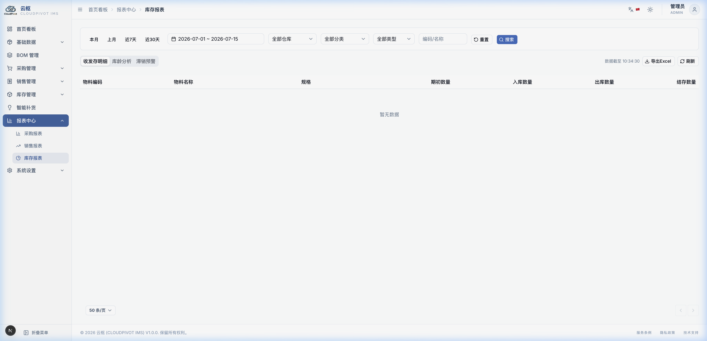

### 2.1 收发存明细表 (最基本的进销存对账单)
*   **怎么看**：
    *   展示每个材料在这个月（或你选的时间段内）的变化轨迹：
        $$\text{月初剩的货} + \text{这个月新收的货} - \text{这个月发出去的货} = \text{月底最后剩的货}$$
    *   **保证对得上**：系统会自动跟每天的出入库流水账对账，确保这个公式在数量和金额上分毫不差。如果对不上，系统会有报错提示。

### 2.2 库龄分析 (货物在库房里躺了多久？)
*   **怎么看**：
    *   上方以彩色饼图展示仓库里的货都放了多久。
        *   `0 - 30 天` (🟢 正常，转得快)
        *   `31 - 90 天` (🟡 警告，货有点积压了)
        *   `91 - 180 天` (🟠 危险，木板放久了容易受潮变形，螺丝容易生锈)
        *   `180 天以上` (🔴 呆滞，已经放了半年以上了，老板建议快点便宜处理掉)
    *   **天数怎么算**：如果材料入库时填了批次号，电脑会自动用 `今天日期 - 入库日期` 算出来它在仓库里呆了几天。

### 2.3 呆滞料分析 (长期不动用的“死库存”)
*   **怎么用**：
    *   输入天数（比如打入 `90` 天）。
    *   点击查询，系统会把那些**已经连续 90 天以上没有产生过任何入库和出库动作**的物料列出来。这些就是压在仓库角落里没人要的货，方便你点数清理。

<!-- END OF 13-reports.md -->


<div style="page-break-before: always;"></div>

<!-- START OF 14-settings.md -->
# 十四、系统设置 (系统大管家)

这里是修改软件基本规则的“中央控制台”。通常由厂长、主管或网管来操作。普通员工只要看看了解就行了。


---

## 1. 各个设置页签都有什么用？

### 1.1 企业信息 (厂名和Logo)
*   **厂子名字**：打入我们厂的法定全名。以后打印送货单时，最上面的厂名抬头就是从这儿来的。
*   **上传 Logo**：上传一张我们厂的图片（只支持 `.png` 格式）。印单子时会自动把我们的 Logo 印在左上角。

### 1.2 编码规则 (单号怎么排？)


*   **单据编码自定义**：
    *   你可以决定买货单（PO）、卖货单（SO）、收货单（PI）的开头字母。
    *   *比如*：采购单你想改成 `CG-` 开头，日期想要 `YYYYMMDD`（如 `20260715`），后面要 3 位流水号（如 `-001`）。
    *   **实时看样子**：你在改的时候，输入框底下会实时显示出单号的样子（如 `CG-20260715-001`）。看顺眼了再点保存。

### 1.3 库存规则 (进出仓默认去哪？)


*   **默认仓库设置**：
    *   在这里设置好：原材料默认送进“原材料仓”，半成品默认进“半成品仓”，成品家具默认进“成品仓”。
    *   *好处*：以后大家开单子录货时，系统会自动帮你填好仓库，不用录单员每次都去选，省事而且不会选错仓库！

### 1.4 打印设置 (双语打印怎么配？)


*   **打印双语选择**：
    *   为了适应中越工厂，我们在打印送货单时，可以选“固定双语”。
    *   **最佳组合**：主语言选“中文”，次语言选“越南语”。这样打印出来的单据，表头和货品单位就会同时有中文和越南文，中越工人都能看懂，不容易搬错货。
*   **纸张大小和边距**：
    *   可选 A4、A5 纸。如果用的是针式打印机，可以选“自定义”，手动填入我们买的纸张宽度和高度（以毫米 mm 为单位）。

### 1.5 汇率管理 (怎么记今天的美元汇率？)


*   **汇率记账规则**：
    *   我们系统以**美元 (USD)** 为基准。财务需要在这里填今天人民币和越南盾的汇率（比如 `1 美元 = 25,300 越南盾`，直接输 `25300`）。
*   **汇率历史防变动铁律**：
    *   你每次修改汇率，旧的汇率都会被存进历史账本里，不会被覆盖。
    *   **为什么这样做**：*比如*你上个月开的采购单汇率是 25,200，今天最新汇率是 25,300。你查上个月账时，**电脑会死死锁定上个月的汇率**，绝对不会跟着今天的汇率变，防止历史账目发生混乱。

### 1.6 数据管理 (备份和防止货丢)


*   **立即备份按钮**：
    *   点击「立即备份」，电脑会自动把所有的账目、物料、单子打包存成一个安全文件。**建议厂里每周点一下**，万一电脑被泼了水或者坏了，能用备份找回所有数据。
*   **全量导出 Excel**：
    *   点一下可以把数据库里的所有货、所有供应商一次性倒进一个巨大的 Excel 表格里，你可以拿回家慢慢看。

### 1.7 操作日志 (谁背锅？)


*   系统会自动用铁笔头记录下谁在什么时候干了什么敏感操作。
*   *比如*：谁改了汇率、谁在几点把某张采购单删除了、谁改了密码。日志记录里会清清楚楚写着：`操作人: 张三，修改了单据 PO-20260715-001 的运费从 200 变到 500`。想赖账是不可能的。

### 1.8 外观设置


*   觉得白色刺眼？点一下「深色主题」，界面瞬间变黑，适合晚上加班或者视力不太好的人用。

<!-- END OF 14-settings.md -->


<div style="page-break-before: always;"></div>

<!-- START OF 15-print-guide.md -->
# 十五、打印指南 (送货单怎么打印对齐？)

在家具厂里，最头疼的就是用针式打印机（比如 Epson LQ-630K）打印那张**三联复写纸（送货单）**，经常会发现字印歪了、印出格了，或者印完第一张，第二张纸就退不回去。

这本指南教你怎么一步步在 Windows 电脑上把纸张大小设置好，确保以后每次打印都整整齐齐。

---

## 1. 打印的基本操作

在采购单、销售单、入库单、出库单详情页面的右上角，都有一个 **「🖨️ 打印单据」** 按钮。点一下它，电脑就会弹出一个打印预览的白底黑字小窗口。

系统针对不同单据，已经排好了格式（如采购单有买什么货，销售单包含打折运费等，对账单包含期初和余额）。

---

## 2. 连续三联纸 (14cm × 22cm) 怎么配置？（重点！跟着做）

如果你们厂用的是长条形、左右有孔的三联复写纸（尺寸通常是宽 14 厘米，长 22 厘米），必须在你的 Windows 电脑上新建这个尺寸，否则打印机会默认按 A4 纸走纸，导致印第二张时严重歪掉。

### 2.1 第一步：在电脑里新建这个纸张尺寸
1.  在 Windows 电脑的左下角开始菜单旁边，搜**「控制面板」**，用鼠标点进去。
2.  在控制面板里找到**「设备和打印机」**，点进去。
3.  鼠标随便点一下列表里的任意一台打印机图标，这时候窗口最上面会出现一行菜单，点里面的**「打印服务器属性」**。
4.  在弹出的框里，勾选**「创建新纸张」**复选框。
5.  在“表单名称”里打入名字，比如写：`三联纸 140x220`。
6.  在底下设置纸张大小：
    *   宽度输入：`14.00 厘米`。
    *   高度输入：`22.00 厘米`。
    *   把四周的边距都改小，填 `0.50 厘米`。
7.  点一下右边的**「保存表单」**按钮，然后点确定关闭。

### 2.2 第二步：让打印机默认使用这个尺寸
1.  回到刚才的「设备和打印机」页面，找到你那台针式打印机图标，在它上面**点鼠标右键**，选**「打印首选项」**。
2.  在弹出的窗口里，把纸张大小改成你刚刚建的 `三联纸 140x220`，点应用保存。
3.  **关键漏掉点**：再次在打印机图标上**点鼠标右键**，选**「打印机属性」**（注意和刚才的区别） -> 进入**「高级」**页签 -> 点最底下的**「打印默认值」**按钮，把里面的纸张大小也改成 `三联纸 140x220`。
    *   *为什么要配两次？*：如果不配打印默认值，当同事共享你的打印机时，格式还是会乱掉。

### 2.3 第三步：在软件弹出的打印预览框里怎么点？
1.  在系统里点「打印单据」，弹出白底预览框后，点「打印」。
2.  **目标打印机**：选你们那台针式打印机。
3.  **纸张大小**：下拉菜单里，**一定要选 `三联纸 140x220`**。
4.  **缩放比例**：**强制选「100%」或者「原始大小」**。
    *   *切记*：不要选“适应纸张”，选了字就会缩小，就对不进印好的格子线里了！
5.  **页边距**：选“无”或者“默认”。
6.  点击打印。

---

## 3. 打印歪了、字浅了怎么办？（常见问题排查）

*   **第一张印得很好，打印完第二张纸整体往上或往下偏了几厘米？**
    *   *原因*：你没有在打印首选项里把尺寸改成 140x220。打印机误以为是用 A4 纸，按 A4 纸的高度滚轮走纸了。请回去严格重做【第二步】。
*   **字印出来偏左或者偏右了几毫米，没对进格子？**
    *   *懒人解决办法*：不用去改电脑上的任何东西。直接走到打印机前面，把进纸卡扣手动往左或往右拨动 5 毫米，纸张物理移动一下，就完美对齐了！
*   **二联、三联上的字非常淡，几乎看不清？**
    *   *原因*：针式打印机是用针头击打复写的，如果敲得太轻，底下的复写纸就没字。
    *   *解决办法*：打印机上一般有一个物理的“压纸杆”（或者浓度旋钮），把它调大一级，让打印针头敲得更使劲一点。另外，检查三联纸有没有反着装（复写涂层有正反面，装反了敲上去底下也是白纸）。

<!-- END OF 15-print-guide.md -->


<div style="page-break-before: always;"></div>

<!-- START OF appendix.md -->
# 附录

这里收集了单据编号规律、好用的键盘快捷键、新手常见问题解答以及工厂专业词语的通俗解释。

---

## 1. 系统单据编号的规律（默认单号开头）

如果你没有去系统设置里修改过编码规则，软件开出的单子默认会以下面的格式排号：

| 单据类型 | 编号开头 | 中间日期格式 | 后面流水号 | 首张单号是什么样子的？ |
|:---|:---|:---|:---|:---|
| **采购单（买货合同）** | `PO` | `年月日` | 3位数字 | `PO-20260715-001` |
| **入库单（收料）** | `PI` | `年月日` | 3位数字 | `PI-20260715-001` |
| **采购退货单** | `PR` | `年月日` | 3位数字 | `PR-20260715-001` |
| **销售单（卖货合同）** | `SO` | `年月日` | 3位数字 | `SO-20260715-001` |
| **出库单（发货）** | `SD` | `年月日` | 3位数字 | `SD-20260715-001` |
| **销售退货单** | `SR` | `年月日` | 3位数字 | `SR-20260715-001` |
| **盘点单** | `SC` | `年月日` | 3位数字 | `SC-20260715-001` |
| **调拨单** | `TF` | `年月日` | 3位数字 | `TF-20260715-001` |
| **自由移动单（手工领用）** | `FM` | `年月日` | 3位数字 | `FM-20260715-001` |
| **物料编码（货品身份证）** | `M` | 无日期 | 4位数字 | `M-0001` (按录入顺序往下排) |
| **进货批次号** | `LOT` | `年月日` | 3位数字 | `LOT-20260715-001` |

---

## 2. 键盘快捷键（熟悉后录单飞快）

如果不想总是用鼠标点来点去，可以用键盘上的这几个快捷组合：

*   **在各种列表页面时**：
    *   `Alt + N`：**快速新建**。比如在物料列表，按这俩键会直接弹出新建物料窗口，不用去点鼠标。
    *   `Ctrl + F`：**快速搜索**。光标会自动跳到搜索框里，你直接打字就行。
    *   `键盘左右方向键 (← / →)`：**翻页**。按右键看下一页，按左键回上一页。
*   **在填表单、录单据明细时**：
    *   `Ctrl + S`：**快速保存**单据。
    *   `Esc` (键盘最左上角的键)：**取消并关闭**弹窗。
    *   `Enter` (回车键)：**录完一行自动加一行**！
        *   *怎么用*：在表格里输入完这一行的数量和价格后，按下回车键，系统会自动保存这一行，并在底下**自动多出一个空行**，光标自动跳入新行的货品选择框，你直接继续选货就行，手不用离开键盘，录单速度提升一倍！

---

## 3. 常见问题解答 FAQ

### Q1: 勾选了“记住我”登录，为什么隔天打开软件还是要我打字输密码？
*   *解答*：有以下几种情况：
    1.  你或者网管在别的地方**修改了你这个账号的密码**。密码一旦改了，之前所有的记住状态都会自动失效。
    2.  你用垃圾清理软件清理了电脑（把软件保存在本地的加密缓存清理了）。
    3.  时间放得太久了（记住我最长只能保持 30 天，超期了需要重新登一次）。

### Q2: 为什么我录入的“期初库存导入”没有生成欠款账目（应收或应付）？
*   *解答*：期初库存导入只是把我们厂里现有的底子登记一下，电脑只把它当作“库存调整”。**只有通过买货的「采购入库单」和卖货的「销售出库单」才会自动记下欠款账**，别的自由入库、调拨等一律不会生成财务欠款，不用担心账目做重。

### Q3: 为什么库存查询里显示的“可用库存”比实际库房里的“当前库存”少？
*   *解答*：因为有货被**锁定预留**了。
    *   *打个比方*：库房里明明堆着 100 张橡木板，但今天上午销售开单卖给客户 A 20 张板子（开好了单但货还没拉走）。
    *   *结果*：这时候，这 20 张板子被锁定预留了。“可用库存”就会显示成 $100 - 20 = 80$ 张。别人要买，最大只能卖 80 张，防止把同一批货重复卖给多个人（超卖）。

### Q4: 导入 Excel 材料表时，为什么有些行报错“计量单位匹配失败”？
*   *解答*：因为你填写的单位（比如“包”或“捆”）在软件里还没有建立。
    *   *解决办法*：请先去 **基础数据 > 单位管理** 里，把这个单位录入进去，然后再去重新导入 Excel 就可以了。

---

## 4. 常用词语通俗解释 (大白话术语表)

*   **SKU (物料档案)**：简单说就是指某一种具体的货品（比如“18mm白橡木拉丝板”就是一个SKU）。
*   **BOM (产品配料表)**：做一件家具需要的全部材料清单。
*   **可用库存**：真正还能拿去卖、或者拿去领料的剩余安全数量。
*   **物理库存 (当前库存)**：仓库里实际堆着的所有货的总数（不管有没有被别人定走）。
*   **预留锁定**：把货先“占个坑”锁定下来，只给指定的单子用，不准别人抢走。
*   **移动加权平均法**：一种算成本的方法。每次进新货的价格不一样，电脑会自动用 `(原有总值 + 新进总值) ÷ 新旧总数量` 重新算一个平均成本，不用你人工打算盘。
*   **倒挤法**：在把整笔费用（比如 10 元运费）分摊给多次送货时，最后一次送货的分摊金额不用乘法比例，而是用 `10元 - 之前已经分掉的钱`，把剩下的一分一毫尾差彻底抹平，保证账目绝对对齐。

<!-- END OF appendix.md -->
